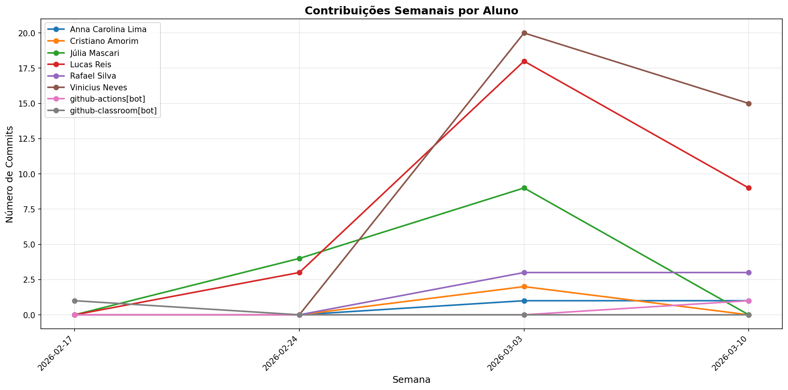

# 📊 Relatório de Contribuições do Projeto

**Última atualização:** 17/03/2026 00:35

---

## 📈 Resumo Geral de Contribuições

| Aluno                 |   Commits |   Linhas+ |   Linhas- |   Arquivos |   Docs Commits |   Docs Arquivos |
|-----------------------|-----------|-----------|-----------|------------|----------------|-----------------|
| Anna Carolina Lima    |         2 |        13 |        10 |          2 |              2 |               2 |
| Cristiano Amorim      |         2 |        17 |         9 |          2 |              1 |               2 |
| Júlia Mascari         |        13 |       116 |        31 |          3 |             11 |               3 |
| Lucas Reis            |        30 |        48 |        48 |          4 |             23 |               3 |
| Rafael Silva          |         6 |        24 |        36 |          3 |              6 |               3 |
| Vinicius Neves        |        35 |   1290971 |   1284698 |       5660 |             19 |               5 |
| github-actions[bot]   |         1 |        28 |        31 |          3 |              1 |               1 |
| github-classroom[bot] |         1 |      2152 |         0 |         45 |              1 |              13 |

## 📅 Contribuições Semanais (Todo o Semestre)

**2026-03-10**: Anna Carolina Lima: 1, Lucas Reis: 9, Rafael Silva: 3, Vinicius Neves: 15, github-actions[bot]: 1

**2026-03-03**: Anna Carolina Lima: 1, Cristiano Amorim: 2, Júlia Mascari: 9, Lucas Reis: 18, Rafael Silva: 3, Vinicius Neves: 20

**2026-02-24**: Júlia Mascari: 4, Lucas Reis: 3

**2026-02-17**: github-classroom[bot]: 1

## 📊 Visualização Gráfica

## ℹ️ Observações

- **Commits**: Número total de commits realizados

- **Linhas+**: Linhas de código adicionadas

- **Linhas-**: Linhas de código removidas

- **Arquivos**: Número de arquivos únicos modificados

- **Docs Commits**: Commits em arquivos de documentação

- **Docs Arquivos**: Arquivos de documentação modificados

---

*Relatório gerado automaticamente via GitHub Actions*
