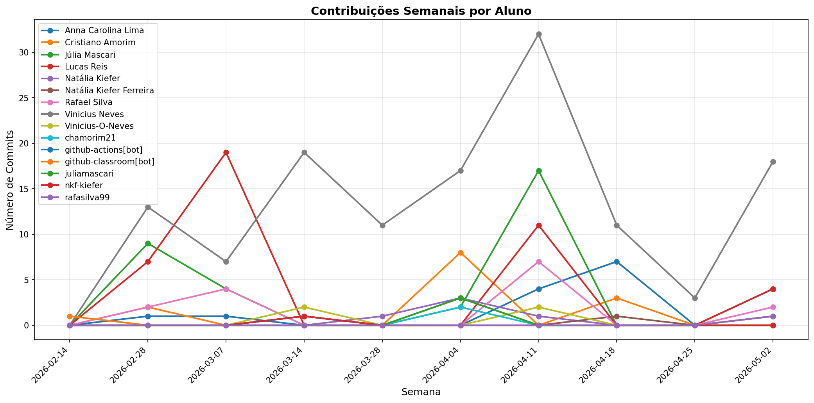

# 📊 Relatório de Contribuições do Projeto

**Última atualização:** 09/05/2026 17:16

---

## 📈 Resumo Geral de Contribuições

| Aluno                   |   Commits |   Linhas+ |   Linhas- |   Arquivos |   Docs Commits |   Docs Arquivos |
|-------------------------|-----------|-----------|-----------|------------|----------------|-----------------|
| Anna Carolina Lima      |        17 |      1602 |       374 |         41 |             11 |               3 |
| Cristiano Amorim        |        13 |       610 |        36 |         23 |              3 |               3 |
| Júlia Mascari           |        32 |       431 |       171 |          8 |             23 |               4 |
| Lucas Reis              |        41 |      8159 |      1257 |         71 |             27 |               3 |
| Natália Kiefer          |         6 |      2805 |       260 |         35 |              3 |               2 |
| Natália Kiefer Ferreira |         6 |        19 |        19 |          1 |              1 |               1 |
| Rafael Silva            |        15 |      1011 |        60 |         48 |             12 |               4 |
| Vinicius Neves          |       131 |   1309790 |   1292571 |       5813 |             43 |               6 |
| Vinicius-O-Neves        |         5 |        52 |        33 |          4 |              3 |               1 |
| chamorim21              |         2 |        28 |        20 |          3 |              2 |               1 |
| github-actions[bot]     |         1 |        28 |        31 |          3 |              1 |               1 |
| github-classroom[bot]   |         1 |      2152 |         0 |         45 |              1 |              13 |
| juliamascari            |         3 |       284 |        92 |         12 |              0 |               0 |
| nkf-kiefer              |         1 |        16 |        15 |          3 |              1 |               1 |
| rafasilva99             |         1 |        10 |         9 |          3 |              1 |               1 |

## 📅 Contribuições Semanais (Todo o Semestre)

**2026-05-02**: Anna Carolina Lima: 4, Lucas Reis: 4, Natália Kiefer: 1, Natália Kiefer Ferreira: 1, Rafael Silva: 2, Vinicius Neves: 18, Vinicius-O-Neves: 1, rafasilva99: 1

**2026-04-25**: Vinicius Neves: 3

**2026-04-18**: Anna Carolina Lima: 7, Cristiano Amorim: 3, Natália Kiefer Ferreira: 1, Vinicius Neves: 11

**2026-04-11**: Anna Carolina Lima: 4, Júlia Mascari: 17, Lucas Reis: 11, Natália Kiefer: 1, Rafael Silva: 7, Vinicius Neves: 32, Vinicius-O-Neves: 2

**2026-04-04**: Cristiano Amorim: 8, Júlia Mascari: 2, Natália Kiefer: 3, Natália Kiefer Ferreira: 3, Vinicius Neves: 17, chamorim21: 2, juliamascari: 3

**2026-03-28**: Natália Kiefer: 1, Vinicius Neves: 11

**2026-03-14**: Natália Kiefer Ferreira: 1, Vinicius Neves: 19, Vinicius-O-Neves: 2, github-actions[bot]: 1, nkf-kiefer: 1

**2026-03-07**: Anna Carolina Lima: 1, Júlia Mascari: 4, Lucas Reis: 19, Rafael Silva: 4, Vinicius Neves: 7

**2026-02-28**: Anna Carolina Lima: 1, Cristiano Amorim: 2, Júlia Mascari: 9, Lucas Reis: 7, Rafael Silva: 2, Vinicius Neves: 13

**2026-02-14**: github-classroom[bot]: 1

## 📊 Visualização Gráfica

## ℹ️ Observações

- **Commits**: Número total de commits realizados

- **Linhas+**: Linhas de código adicionadas

- **Linhas-**: Linhas de código removidas

- **Arquivos**: Número de arquivos únicos modificados

- **Docs Commits**: Commits em arquivos de documentação

- **Docs Arquivos**: Arquivos de documentação modificados

---

*Relatório gerado automaticamente via GitHub Actions*
