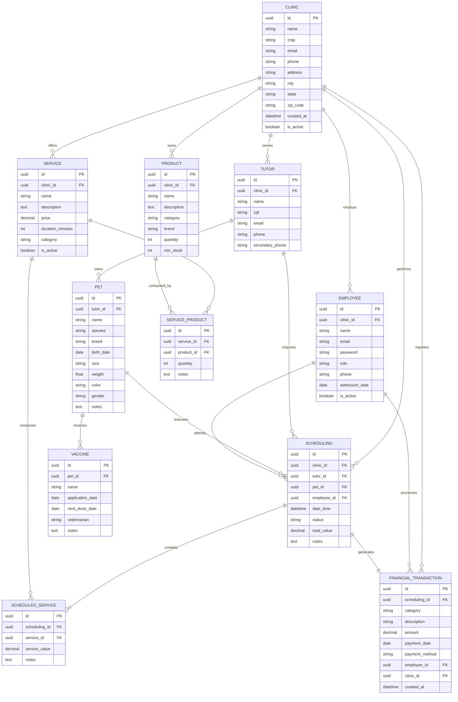

# APIs e Web Services

O planejamento de uma aplicação de APIS Web é uma etapa fundamental para o sucesso do projeto. Ao planejar adequadamente, você pode evitar muitos problemas e garantir que a sua API seja segura, escalável e eficiente.

Aqui estão algumas etapas importantes que devem ser consideradas no planejamento de uma aplicação de APIS Web.

[Inclua uma breve descrição do projeto.]

## Objetivos da API

O primeiro passo é definir os objetivos da sua API. O que você espera alcançar com ela? Você quer que ela seja usada por clientes externos ou apenas por aplicações internas? Quais são os recursos que a API deve fornecer?

[Inclua os objetivos da sua api.]


## Modelagem da Aplicação
## Arquitetura da Solução

## Diagrama de Entidade Relacionamento (ERD)



## Detalhe das tabelas

### 1. Tabela `CLINIC`

Armazena informações das clínicas/pet shops do sistema.

| Campo | Tipo | Restrições | Descrição |
|-------|------|-------------|-------------|
| id | UUID(36) | PK | Identificador único (UUID) |
| name | VARCHAR(100) | NOT NULL | Nome da clínica |
| cnpj | VARCHAR(18) | UNIQUE | CNPJ |
| email | VARCHAR(100) | | E-mail |
| phone | VARCHAR(15) | | Telefone |
| address | VARCHAR(200) | | Endereço |
| city | VARCHAR(50) | | Cidade |
| state | VARCHAR(2) | | Estado |
| zip_code | VARCHAR(9) | | CEP |
| created_at | DATETIME | NOT NULL, DEFAULT CURRENT_TIMESTAMP | Data de cadastro |
| is_active | BOOLEAN | NOT NULL, DEFAULT TRUE | Status da clínica |

---

### 2. Tabela `TUTOR`

Armazena informações dos tutores (donos) dos pets.

| Campo | Tipo | Restrições | Descrição |
|-------|------|-------------|-------------|
| id | UUID(36) | PK | Identificador único (UUID) |
| clinic_id | UUID(36) | FK, NOT NULL | Referência para a clínica |
| name | VARCHAR(100) | NOT NULL | Nome completo |
| cpf | VARCHAR(14) | UNIQUE | CPF |
| email | VARCHAR(100) | | E-mail |
| phone | VARCHAR(15) | NOT NULL | Telefone |
| secondary_phone | VARCHAR(15) | | Telefone secundário |

---

### 3. Tabela `PET`

Armazena informações dos pets vinculados aos tutores.

| Campo | Tipo | Restrições | Descrição |
|-------|------|-------------|-------------|
| id | UUID(36) | PK | Identificador único (UUID) |
| tutor_id | UUID(36) | FK, NOT NULL | Referência para o tutor |
| name | VARCHAR(50) | NOT NULL | Nome do pet |
| species | VARCHAR(30) | NOT NULL | Espécie (Cachorro, Gato, etc.) |
| breed | VARCHAR(50) | | Raça |
| birth_date | DATE | | Data de nascimento |
| size | VARCHAR(20) | | Porte (Pequeno, Médio, Grande) |
| weight | DECIMAL(5,2) | | Peso em kg |
| color | VARCHAR(30) | | Cor da pelagem |
| gender | CHAR(1) | | M (Macho) / F (Fêmea) |
| notes | TEXT | | Observações médicas/comportamentais |

---

### 4. Tabela `VACCINE`

Armazena o histórico de vacinação dos pets.

| Campo | Tipo | Restrições | Descrição |
|-------|------|-------------|-------------|
| id | UUID(36) | PK | Identificador único (UUID) |
| pet_id | UUID(36) | FK, NOT NULL | Referência para o pet |
| name | VARCHAR(100) | NOT NULL | Nome da vacina |
| application_date | DATE | NOT NULL | Data de aplicação |
| next_dose_date | DATE | | Data da próxima dose |
| veterinarian | VARCHAR(100) | | Nome do veterinário |
| notes | TEXT | | Observações adicionais |

---

### 5. Tabela `EMPLOYEE`

Armazena os usuários do sistema (funcionários) vinculados à clínica.

| Campo | Tipo | Restrições | Descrição |
|-------|------|-------------|-------------|
| id | UUID(36) | PK | Identificador único (UUID) |
| clinic_id | UUID(36) | FK, NOT NULL | Referência para a clínica |
| name | VARCHAR(100) | NOT NULL | Nome completo |
| email | VARCHAR(100) | UNIQUE, NOT NULL | E-mail (login) |
| password | VARCHAR(255) | NOT NULL | Senha criptografada |
| role | VARCHAR(30) | NOT NULL | Função no sistema |
| phone | VARCHAR(15) | | Telefone de contato |
| admission_date | DATE | | Data de admissão |
| is_active | BOOLEAN | NOT NULL, DEFAULT TRUE | Status do funcionário |

---

### 6. Tabela `SERVICE`

Armazena os serviços oferecidos pelo pet shop.

| Campo | Tipo | Restrições | Descrição |
|-------|------|-------------|-------------|
| id | UUID(36) | PK | Identificador único (UUID) |
| name | VARCHAR(100) | NOT NULL | Nome do serviço |
| description | TEXT | | Descrição detalhada |
| price | DECIMAL(10,2) | NOT NULL | Preço |
| duration_minutes | INT | | Duração estimada em minutos |
| category | VARCHAR(30) | NOT NULL | Categoria do serviço |
| is_active | BOOLEAN | NOT NULL, DEFAULT TRUE | Status do serviço |

---

### 7. Tabela `SERVICE_PRODUCT` (Tabela de Junção)

Relaciona serviços com os produtos que utilizam (N:N).

| Campo | Tipo | Restrições | Descrição |
|-------|------|-------------|-------------|
| id | UUID(36) | PK | Identificador único (UUID) |
| service_id | UUID(36) | FK, NOT NULL | Referência para o serviço |
| product_id | UUID(36) | FK, NOT NULL | Referência para o produto |
| quantity | INT | NOT NULL | Quantidade utilizada no serviço |
| notes | TEXT | | Observações sobre o uso do produto |

---

### 8. Tabela `PRODUCT`

Controla o estoque de produtos da clínica.

| Campo | Tipo | Restrições | Descrição |
|-------|------|-------------|-------------|
| id | UUID(36) | PK | Identificador único (UUID) |
| clinic_id | UUID(36) | FK, NOT NULL | Referência para a clínica |
| name | VARCHAR(100) | NOT NULL | Nome do produto |
| description | TEXT | | Descrição detalhada |
| category | VARCHAR(30) | NOT NULL | Categoria do produto |
| brand | VARCHAR(50) | | Marca |
| quantity | INT | NOT NULL, DEFAULT 0 | Quantidade |
| min_stock | INT | NOT NULL, DEFAULT 0 | Estoque mínimo para alerta |

---

### 9. Tabela `SCHEDULING`

Registra os agendamentos de serviços realizados pela clínica.

| Campo | Tipo | Restrições | Descrição |
|-------|------|-------------|-------------|
| id | UUID(36) | PK | Identificador único (UUID) |
| clinic_id | UUID(36) | FK, NOT NULL | Clínica responsável |
| tutor_id | UUID(36) | FK, NOT NULL | Tutor solicitante |
| pet_id | UUID(36) | FK, NOT NULL | Pet a ser atendido |
| employee_id | UUID(36) | FK, NOT NULL | Profissional responsável |
| date_time | DATETIME | NOT NULL | Data e hora do agendamento |
| status | VARCHAR(20) | NOT NULL | Status do agendamento |
| total_value | DECIMAL(10,2) | NOT NULL | Valor total do agendamento |
| notes | TEXT | | Observações gerais |

**Status Possíveis:**
- `Agendado` - Agendamento criado
- `Confirmado` - Confirmado pelo tutor
- `Em Andamento` - Serviço em execução
- `Concluído` - Serviço finalizado
- `Cancelado` - Agendamento cancelado

---

### 10. Tabela `SCHEDULED_SERVICE` (Tabela de Junção)

Relaciona agendamentos com serviços (N:N).

| Campo | Tipo | Restrições | Descrição |
|-------|------|-------------|-------------|
| id | UUID(36) | PK | Identificador único (UUID) |
| scheduling_id | UUID(36) | FK, NOT NULL | Referência para o agendamento |
| service_id | UUID(36) | FK, NOT NULL | Referência para o serviço |
| service_value | DECIMAL(10,2) | NOT NULL | Valor do serviço no momento do agendamento |
| notes | TEXT | | Observações específicas do serviço |

---

### 11. Tabela `FINANCIAL_TRANSACTION`

Registra receitas e despesas do pet shop (uma por agendamento).

| Campo | Tipo | Restrições | Descrição |
|-------|------|-------------|-------------|
| id | UUID(36) | PK | Identificador único (UUID) |
| scheduling_id | UUID(36) | FK, UNIQUE, NOT NULL | Agendamento relacionado (único) |
| category | VARCHAR(50) | NOT NULL | Categoria da transação |
| description | VARCHAR(200) | NOT NULL | Descrição detalhada |
| amount | DECIMAL(10,2) | NOT NULL | Valor da transação |
| due_date | DATE | | Data de vencimento |
| payment_date | DATE | | Data do pagamento |
| status | VARCHAR(20) | NOT NULL | Status do pagamento |
| payment_method | VARCHAR(20) | | Forma de pagamento |
| employee_id | UUID(36) | FK, NOT NULL | Funcionário responsável |
| clinic_id | UUID(36) | FK, NOT NULL | Clínica responsável |
| created_at | DATETIME | NOT NULL, DEFAULT CURRENT_TIMESTAMP | Data de criação |

**Status Possíveis:**
- `Pendente` - Aguardando pagamento
- `Pago` - Pagamento realizado
- `Cancelado` - Transação cancelada


## Tecnologias Utilizadas

Existem muitas tecnologias diferentes que podem ser usadas para desenvolver APIs Web. A tecnologia certa para o seu projeto dependerá dos seus objetivos, dos seus clientes e dos recursos que a API deve fornecer.

[Lista das tecnologias principais que serão utilizadas no projeto.]

## API Endpoints

[Liste os principais endpoints da API, incluindo as operações disponíveis, os parâmetros esperados e as respostas retornadas.]

### Endpoint 1
- Método: GET
- URL: /endpoint1
- Parâmetros:
  - param1: [descrição]
- Resposta:
  - Sucesso (200 OK)
    ```
    {
      "message": "Success",
      "data": {
        ...
      }
    }
    ```
  - Erro (4XX, 5XX)
    ```
    {
      "message": "Error",
      "error": {
        ...
      }
    }
    ```

## Considerações de Segurança

[Discuta as considerações de segurança relevantes para a aplicação distribuída, como autenticação, autorização, proteção contra ataques, etc.]

## Implantação

[Instruções para implantar a aplicação distribuída em um ambiente de produção.]

1. Defina os requisitos de hardware e software necessários para implantar a aplicação em um ambiente de produção.
2. Escolha uma plataforma de hospedagem adequada, como um provedor de nuvem ou um servidor dedicado.
3. Configure o ambiente de implantação, incluindo a instalação de dependências e configuração de variáveis de ambiente.
4. Faça o deploy da aplicação no ambiente escolhido, seguindo as instruções específicas da plataforma de hospedagem.
5. Realize testes para garantir que a aplicação esteja funcionando corretamente no ambiente de produção.

## Testes

[Descreva a estratégia de teste, incluindo os tipos de teste a serem realizados (unitários, integração, carga, etc.) e as ferramentas a serem utilizadas.]

1. Crie casos de teste para cobrir todos os requisitos funcionais e não funcionais da aplicação.
2. Implemente testes unitários para testar unidades individuais de código, como funções e classes.
3. Realize testes de integração para verificar a interação correta entre os componentes da aplicação.
4. Execute testes de carga para avaliar o desempenho da aplicação sob carga significativa.
5. Utilize ferramentas de teste adequadas, como frameworks de teste e ferramentas de automação de teste, para agilizar o processo de teste.

# Referências

Inclua todas as referências (livros, artigos, sites, etc) utilizados no desenvolvimento do trabalho.