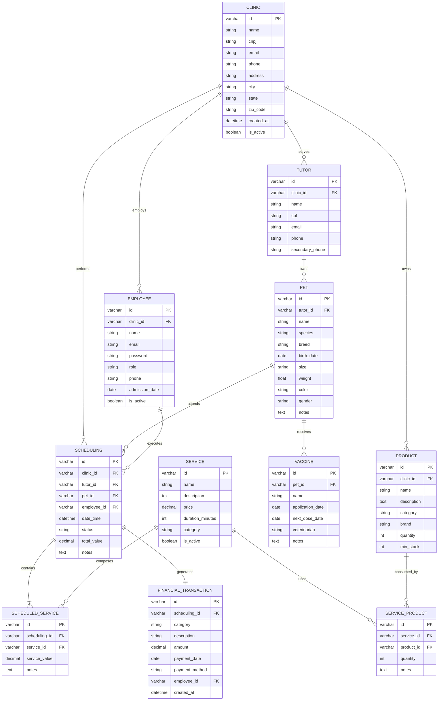

# APIs e Web Services

O planejamento de uma aplicação de APIS Web é uma etapa fundamental para o sucesso do projeto. Ao planejar adequadamente, você pode evitar muitos problemas e garantir que a sua API seja segura, escalável e eficiente.

## Objetivos da API

O Pet Flow visa centralizar as informações operacionais do pet shop em tempo real, permitindo que gestores e equipes acessem e atualizem dados de qualquer dispositivo de forma segura e eficiente.

## Especificações Técnicas

### Requisitos Funcionais

|ID    | Descrição do Requisito  | Prioridade |
|------|-----------------------------------------|----|
|RF-001| Cadastro e login de usuários | ALTA |
|RF-002| Cadastro, edição e exclusão de clientes  | ALTA |
|RF-003| Cadastro, edição e exclusão de pets  | ALTA |
|RF-004| Cadastro, edição e exclusão de serviços | ALTA |
|RF-005| Realizar, editar e cancelar agendamentos | ALTA |
|RF-006| Controle de entrada e saída de estoque   | MÉDIA |
|RF-007| Registro de receitas e despesas | MÉDIA |

### Requisitos não Funcionais

|ID     | Descrição do Requisito  |Prioridade |
|-------|-------------------------|----|
|RNF-001| O sistema deve ser desenvolvido utilizando uma arquitetura de microserviços (ou módulos desacoplados) para permitir atualizações independentes de cada componente | ALTA | 
|RNF-002|O sistema deve garantir a segurança das informações através da criptografia de dados sensíveis e assegurar a disponibilidade do serviço para os usuários finais |  ALTA | 
|RNF-003| A interface deve ser totalmente responsiva, garantindo a mesma experiência de usuário em resoluções de desktop, tablets e smartphones |  MÉDIA | 
|RNF-004| O acesso às funcionalidades do sistema deve ser restrito através de login e senha para cada tipo de usuário |  ALTA | 
|RNF-005| As respostas das consultas devem ser exibidas em até 5 segundos, caso o processamento exceda esse tempo irá exibir uma mensagem de erro  |  MÉDIA | 

### Restrições

|ID| Restrição                                             |
|--|-------------------------------------------------------|
|01| O projeto deverá ser desenvolvido e entregue dentro do prazo definido pelo cronograma acadêmico da disciplina, até o final do semestre letivo. |

---

## Catálogo de Serviços

### 1. Autenticação de Usuários
Permite que funcionários da clínica se cadastrem e acessem o sistema via e-mail e senha, com controle de acesso baseado em perfis.

### 2. Gestão de Clientes (Tutores)
Gerenciamento completo (cadastro, edição, exclusão, consulta) dos responsáveis pelos pets.

### 3. Gestão de Pets
Cadastro e histórico de saúde/atendimento dos animais vinculados aos tutores.

### 4. Gestão de Serviços
Configuração de serviços oferecidos pelo pet shop (preço, descrição, duração).

### 5. Agendamento de Atendimentos
Organização de horários, associação de profissionais e acompanhamento de status.

### 6. Controle de Estoque
Monitoramento de produtos, entradas/saídas e níveis mínimos para reposição.

### 7. Gestão Financeira
Registro de receitas e despesas vinculadas aos atendimentos, com histórico de movimentações.

---

## Tecnologias Utilizadas

- **Backend**: Node.js com Express e TypeScript.
- **Banco de Dados**: Supabase (PostgreSQL).
- **Documentação**: Swagger / OpenAPI.
- **Criptografia**: Crypto (Node.js) para dados sensíveis.

## Modelagem da Aplicação

### Diagrama de Entidade Relacionamento (ERD)

## Detalhe das Tabelas

### 1. Tabela `CLINIC`
Armazena informações das clínicas/pet shops do sistema.

| Campo | Tipo | Restrições | Descrição |
|-------|------|-------------|-------------|
| id | VARCHAR(36) | PK | Identificador único (UUID) |
| name | VARCHAR(100) | NOT NULL | Nome da clínica |
| cnpj | VARCHAR(18) | UNIQUE | CNPJ |
| email | VARCHAR(100) | | E-mail |
| phone | VARCHAR(15) | | Telefone |
| address | VARCHAR(200) | | Endereço |
| city | VARCHAR(50) | | Cidade |
| state | VARCHAR(2) | | Estado |
| zip_code | VARCHAR(9) | | CEP |
| created_at | DATETIME | NOT NULL, DEFAULT CURRENT_TIMESTAMP | Data de cadastro |
| is_active | BOOLEAN | NOT NULL, DEFAULT TRUE | Status da clínica |

---

### 2. Tabela `TUTOR`
Armazena informações dos tutores (donos) dos pets.

| Campo | Tipo | Restrições | Descrição |
|-------|------|-------------|-------------|
| id | VARCHAR(36) | PK | Identificador único (UUID) |
| clinic_id | VARCHAR(36) | FK, NOT NULL | Referência para a clínica |
| name | VARCHAR(100) | NOT NULL | Nome completo |
| cpf | VARCHAR(14) | UNIQUE | CPF |
| email | VARCHAR(100) | | E-mail |
| phone | VARCHAR(15) | NOT NULL | Telefone |
| secondary_phone | VARCHAR(15) | | Telefone secundário |

---

### 3. Tabela `PET`
Armazena informações dos pets vinculados aos tutores.

| Campo | Tipo | Restrições | Descrição |
|-------|------|-------------|-------------|
| id | VARCHAR(36) | PK | Identificador único (UUID) |
| tutor_id | VARCHAR(36) | FK, NOT NULL | Referência para o tutor |
| name | VARCHAR(50) | NOT NULL | Nome do pet |
| species | VARCHAR(30) | NOT NULL | Espécie (Cachorro, Gato, etc.) |
| breed | VARCHAR(50) | | Raça |
| birth_date | DATE | | Data de nascimento |
| size | VARCHAR(20) | | Porte (Pequeno, Médio, Grande) |
| weight | DECIMAL(5,2) | | Peso em kg |
| color | VARCHAR(30) | | Cor da pelagem |
| gender | CHAR(1) | | M (Macho) / F (Fêmea) |
| notes | TEXT | | Observações médicas/comportamentais |

---

### 4. Tabela `VACCINE`
Armazena o histórico de vacinação dos pets.

| Campo | Tipo | Restrições | Descrição |
|-------|------|-------------|-------------|
| id | VARCHAR(36) | PK | Identificador único (UUID) |
| pet_id | VARCHAR(36) | FK, NOT NULL | Referência para o pet |
| name | VARCHAR(100) | NOT NULL | Nome da vacina |
| application_date | DATE | NOT NULL | Data de aplicação |
| next_dose_date | DATE | | Data da próxima dose |
| veterinarian | VARCHAR(100) | | Nome do veterinário |
| notes | TEXT | | Observações adicionais |

---

### 5. Tabela `EMPLOYEE`
Armazena os usuários do sistema (funcionários) vinculados à clínica.

| Campo | Tipo | Restrições | Descrição |
|-------|------|-------------|-------------|
| id | VARCHAR(36) | PK | Identificador único (UUID) |
| clinic_id | VARCHAR(36) | FK, NOT NULL | Referência para a clínica |
| name | VARCHAR(100) | NOT NULL | Nome completo |
| email | VARCHAR(100) | UNIQUE, NOT NULL | E-mail (login) |
| password | VARCHAR(255) | NOT NULL | Senha criptografada |
| role | VARCHAR(30) | NOT NULL | Função no sistema |
| phone | VARCHAR(15) | | Telefone de contato |
| admission_date | DATE | | Data de admissão |
| is_active | BOOLEAN | NOT NULL, DEFAULT TRUE | Status do funcionário |

---

### 6. Tabela `SERVICE`
Armazena os serviços oferecidos pelo pet shop.

| Campo | Tipo | Restrições | Descrição |
|-------|------|-------------|-------------|
| id | VARCHAR(36) | PK | Identificador único (UUID) |
| name | VARCHAR(100) | NOT NULL | Nome do serviço |
| description | TEXT | | Descrição detalhada |
| price | DECIMAL(10,2) | NOT NULL | Preço |
| duration_minutes | INT | | Duração estimada em minutos |
| category | VARCHAR(30) | NOT NULL | Categoria do serviço |
| is_active | BOOLEAN | NOT NULL, DEFAULT TRUE | Status do serviço |

---

### 7. Tabela `PRODUCT`
Controla o estoque de produtos da clínica.

| Campo | Tipo | Restrições | Descrição |
|-------|------|-------------|-------------|
| id | VARCHAR(36) | PK | Identificador único (UUID) |
| clinic_id | VARCHAR(36) | FK, NOT NULL | Referência para a clínica |
| name | VARCHAR(100) | NOT NULL | Nome do produto |
| description | TEXT | | Descrição detalhada |
| category | VARCHAR(30) | NOT NULL | Categoria do produto |
| brand | VARCHAR(50) | | Marca |
| quantity | INT | NOT NULL, DEFAULT 0 | Quantidade |
| min_stock | INT | NOT NULL, DEFAULT 0 | Estoque mínimo para alerta |

---

### 8. Tabela `SCHEDULING`
Registra os agendamentos de serviços realizados pela clínica.

| Campo | Tipo | Restrições | Descrição |
|-------|------|-------------|-------------|
| id | VARCHAR(36) | PK | Identificador único (UUID) |
| clinic_id | VARCHAR(36) | FK, NOT NULL | Clínica responsável |
| tutor_id | VARCHAR(36) | FK, NOT NULL | Tutor solicitante |
| pet_id | VARCHAR(36) | FK, NOT NULL | Pet a ser atendido |
| employee_id | VARCHAR(36) | FK, NOT NULL | Profissional responsável |
| date_time | DATETIME | NOT NULL | Data e hora do agendamento |
| status | VARCHAR(20) | NOT NULL | Status do agendamento |
| total_value | DECIMAL(10,2) | NOT NULL | Valor total do agendamento |
| notes | TEXT | | Observações gerais |

---

### 9. Tabela `FINANCIAL_TRANSACTION`
Registra receitas e despesas do pet shop (uma por agendamento).

| Campo | Tipo | Restrições | Descrição |
|-------|------|-------------|-------------|
| id | VARCHAR(36) | PK | Identificador único (UUID) |
| scheduling_id | VARCHAR(36) | FK, UNIQUE, NOT NULL | Agendamento relacionado (único) |
| category | VARCHAR(50) | NOT NULL | Categoria da transação |
| description | VARCHAR(200) | NOT NULL | Descrição detalhada |
| amount | DECIMAL(10,2) | NOT NULL | Valor da transação |
| payment_date | DATE | | Data do pagamento |
| payment_method | VARCHAR(20) | | Forma de pagamento |
| employee_id | VARCHAR(36) | FK, NOT NULL | Funcionário responsável |
| created_at | DATETIME | NOT NULL, DEFAULT CURRENT_TIMESTAMP | Data de criação |

---

## API Endpoints (Módulo Financeiro)

A documentação completa e interativa dos endpoints está disponível via Swagger em: `http://localhost:3000/api-docs`

**IMPORTANTE:** Para maior segurança e proteção de dados sensíveis em logs de servidor, os identificadores (`id`, `clinicId`, `employeeId`) devem ser enviados obrigatoriamente no **Corpo da Requisição (JSON Body)**.

### Principais Endpoints

#### Listar Transações
- **Método**: POST
- **URL**: `/financial/all`
- **Body**: `{ "clinicId": "...", "employeeId": "..." }`

#### Obter Detalhe da Transação
- **Método**: POST
- **URL**: `/financial/detail`
- **Body**: `{ "id": "...", "clinicId": "..." }`

#### Criar Transação
- **Método**: POST
- **URL**: `/financial`
- **Body**: Inclui todos os dados da transação + `clinicId`.

#### Atualizar Transação
- **Método**: PUT
- **URL**: `/financial`
- **Body**: `{ "id": "...", "clinicId": "...", ...campos }`

#### Excluir Transação
- **Método**: DELETE
- **URL**: `/financial`
- **Body**: `{ "id": "...", "clinicId": "..." }`

## Considerações de Segurança

- **Isolamento Multi-tenant**: Toda consulta é filtrada obrigatoriamente por `clinic_id`.
- **Proteção de IDs**: Identificadores são passados via Body para evitar vazamento em logs de URL (Security-by-Design).
- **Autenticação**: Uso de Bearer JWT para todos os endpoints protegidos.

## Implantação

1. Configurar `.env` com dados do Supabase e chaves de criptografia.
2. `npm install`
3. `npm run dev`
