# APIs e Web Services

O Pet Flow é uma solução voltada para gestão de pet shops, criada para facilitar a organização das rotinas operacionais e melhorar a qualidade do atendimento ao cliente. A plataforma permite centralizar informações importantes do dia a dia do estabelecimento, como agendamentos de serviços, cadastro de clientes e registro dos pets, além do controle de estoque e da parte financeira, tornando esses processos mais práticos.

O sistema é estruturado em uma arquitetura distribuída, na qual diferentes partes funcionam de forma independente, mas conectadas. A integração entre a interface e o banco de dados ocorre por meio de uma API, que permite o envio e a atualização das informações em tempo real, garantindo acesso seguro e centralizado.

## Objetivos da API

A API é o núcleo do sistema, responsável por conectar as interfaces web e mobile ao banco de dados, garantindo que as informações sejam acessadas de forma segura, organizada e consistente. Sua estrutura em camadas facilita a manutenção e evolução da aplicação, centralizando toda a lógica de negócio em um único ponto.

- **Autenticação de usuários:** acesso seguro ao sistema por meio de JWT, com controle de permissões por perfil  
- **Gestão de usuários:** cadastro, login e manutenção de dados, com validações para garantir integridade das informações  
- **Gestão de pets:** cadastro, atualização e consulta de dados dos animais, permitindo o acompanhamento das informações  
- **Controle de serviços:** cadastro, edição e consulta dos serviços oferecidos pelo estabelecimento  
- **Gestão de agendamentos:** criação, atualização e cancelamento de atendimentos, com validação para evitar conflitos de horário  
- **Gestão financeira:** registro e controle de receitas e despesas do pet shop  
- **Gestão de estoque:** acompanhamento e controle de produtos disponíveis  

## Modelagem da Aplicação

### Diagrama de Entidade Relacionamento (DER)
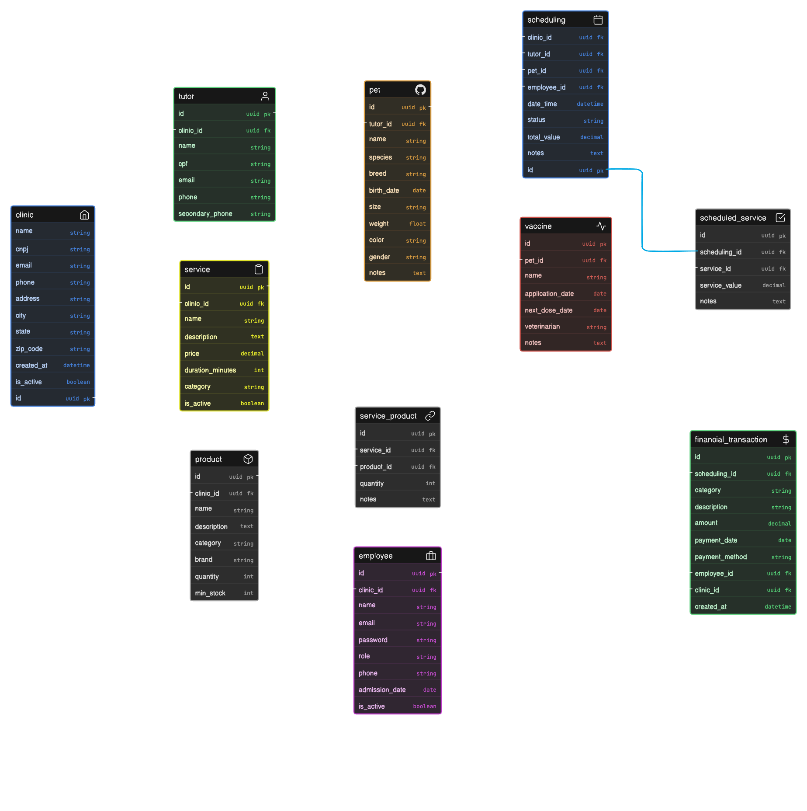

## Tecnologias Utilizadas

As principais tecnologias utilizadas no desenvolvimento da API são:

### Backend
- Node.js  
- Express.js  
- TypeScript  
- JWT (JSON Web Token para autenticação)  
- Zod (validação de dados)  
- Swagger / OpenAPI (documentação da API)  
- bcrypt (hash de senhas)  
- AES-256-CBC (criptografia de dados sensíveis)  

### Banco de Dados
- PostgreSQL (via Supabase)  

### Ferramentas de Desenvolvimento
- ESLint (padronização de código)  
- Prettier (formatação de código)  

## API Endpoints

A documentação completa e interativa dos endpoints da API está disponível no Swagger UI em http://localhost:3000/api-docs (ou na URL de produção). Nela é possível testar todas as rotas diretamente na interface, visualizar os esquemas de request/response e entender os parâmetros obrigatórios.

Abaixo, uma visão de alguns dos principais endpoints. Todos os endpoints (exceto autenticação) requerem um token JWT no header, obtido via login.

### Autenticação (`/auth`)

#### `POST /api/v1/auth/register` — Criar Usuário

- Descrição: cria um novo usuário no sistema.
  
**Body (JSON):**

```json
{
  "clinicId": "uuid-da-clinica",
  "name": "nome-usuario",
  "email": "email@exemplo.com",
  "password": "senha-segura",
  "role": "cargo-usuario",
  "phone": "telefone-usuario"
}
```

**Respostas:**

`201 Created` — Usuário criado com sucesso

```json
{
  "user_id": "uuid-do-usuario",
  "token": "token-do-usuario"
}
```

`400 Bad Request` —  Dados inválidos ou falha no cadastro

```json
{
  "error": "Dados inválidos ou usuário não cadastrado"
}
```

### Funcionários

#### 1. Registro de Funcionário
- **Método:** `POST`
- **URL:** `/api/v1/auth/register`
- **Parâmetros (Body JSON):**
  - `email`: Email do funcionário (String)
  - `password`: Senha do funcionário (String)
- **Resposta:**
  - Sucesso (201 Created)
    ```json
    {
      "user_id": "uuid-do-usuario",
      "token": "token-de-autenticacao"
    }
    ```
  - Erro (400 Bad Request)
    ```json
    {
      "error": "Dados inválidos ou usuário não cadastrado"
    }
    ```

#### 2. Login de Funcionário
- **Método:** `POST`
- **URL:** `/api/v1/auth/login`
- **Parâmetros (Body JSON):**
  - `email`: Email do funcionário (String)
  - `password`: Senha do funcionário (String)
- **Resposta:**
  - Sucesso (200 OK)
    ```json
    {
      "user_id": "uuid-do-usuario",
      "token": "token-de-autenticacao"
    }
    ```
  - Erro (401 Unauthorized)
    ```json
    {
      "error": "Invalid credentials"
    }
    ```

### Financeiro (`/financial`)

O módulo financeiro permite o controle completo das transações financeiras do pet shop, incluindo receitas e despesas. Todas as rotas requerem autenticação via token JWT no header `Authorization: Bearer TOKEN`.

#### 1. Listar todas as transações
- **Método:** `POST`
- **URL:** `/api/v1/financial/all`
- **Descrição:** Retorna todas as transações financeiras. Aceita filtros opcionais por clínica e/ou funcionário.
- **Parâmetros (Body JSON):**
  - `clinicId`: ID da clínica (String) — opcional, filtra transações por clínica
  - `employeeId`: ID do funcionário (String) — opcional, filtra transações por funcionário
- **Resposta:**
  - Sucesso (200 OK)
    ```json
    [
      {
        "id": "uuid-da-transacao",
        "schedulingId": "uuid-do-agendamento",
        "description": "Pagamento de Banho e Tosa",
        "amount": 150.0,
        "paymentMethod": "Cartão de Crédito",
        "employeeId": "uuid-do-funcionario",
        "clinicId": "uuid-da-clinica",
        "createdAt": "2026-03-31T20:00:00.000Z"
      }
    ]
    ```
  - Sucesso sem resultados (200 OK)
    ```json
    []
    ```
  - Erro (500 Internal Server Error)
    ```json
    {
      "error": "Internal Server Error"
    }
    ```

#### 2. Obter detalhes de uma transação
- **Método:** `POST`
- **URL:** `/api/v1/financial/detail`
- **Descrição:** Retorna os detalhes de uma transação específica. Requer `id` e `clinicId` para garantir isolamento por clínica.
- **Parâmetros (Body JSON):**
  - `id`: ID da transação (String) — **obrigatório**
  - `clinicId`: ID da clínica (String) — **obrigatório**
- **Resposta:**
  - Sucesso (200 OK)
    ```json
    {
      "id": "uuid-da-transacao",
      "schedulingId": "uuid-do-agendamento",
      "description": "Pagamento de Banho e Tosa",
      "amount": 150.0,
      "paymentMethod": "Cartão de Crédito",
      "employeeId": "uuid-do-funcionario",
      "clinicId": "uuid-da-clinica",
      "createdAt": "2026-03-31T20:00:00.000Z"
    }
    ```
  - Erro (400 Bad Request) — campos obrigatórios ausentes
    ```json
    {
      "error": "id and clinicId are required in body"
    }
    ```
  - Erro (404 Not Found)
    ```json
    {
      "error": "Not Found or Unauthorized"
    }
    ```

#### 3. Criar transação financeira
- **Método:** `POST`
- **URL:** `/api/v1/financial/`
- **Descrição:** Cria uma nova transação financeira vinculada a um agendamento, funcionário e clínica.
- **Parâmetros (Body JSON):**
  - `scheduling_id`: ID do agendamento (String)
  - `description`: Descrição da transação (String)
  - `amount`: Valor da transação (Number)
  - `payment_method`: Método de pagamento (String)
  - `employee_id`: ID do funcionário responsável (String)
  - `clinic_id`: ID da clínica (String)
- **Resposta:**
  - Sucesso (201 Created)
    ```json
    {
      "id": "uuid-da-transacao",
      "schedulingId": "uuid-do-agendamento",
      "description": "Pagamento de Banho e Tosa",
      "amount": 150.0,
      "paymentMethod": "Cartão de Crédito",
      "employeeId": "uuid-do-funcionario",
      "clinicId": "uuid-da-clinica",
      "createdAt": "2026-03-31T20:00:00.000Z"
    }
    ```
  - Erro (400 Bad Request)
    ```json
    {
      "error": "Failed to create"
    }
    ```

#### 4. Atualizar transação financeira
- **Método:** `PUT`
- **URL:** `/api/v1/financial/`
- **Descrição:** Atualiza uma transação existente. Requer `id` e `clinicId` no body para validar a autorização. Os demais campos são opcionais.
- **Parâmetros (Body JSON):**
  - `id`: ID da transação (String) — **obrigatório**
  - `clinicId`: ID da clínica (String) — **obrigatório**
  - `scheduling_id`: ID do agendamento (String) — opcional
  - `description`: Descrição da transação (String) — opcional
  - `amount`: Valor da transação (Number) — opcional
  - `payment_method`: Método de pagamento (String) — opcional
  - `employee_id`: ID do funcionário responsável (String) — opcional
- **Resposta:**
  - Sucesso (200 OK)
    ```json
    {
      "id": "uuid-da-transacao",
      "schedulingId": "uuid-do-agendamento",
      "description": "Pagamento de Banho e Tosa",
      "amount": 150.0,
      "paymentMethod": "Cartão de Crédito",
      "employeeId": "uuid-do-funcionario",
      "clinicId": "uuid-da-clinica",
      "createdAt": "2026-03-31T20:00:00.000Z"
    }
    ```
  - Erro (400 Bad Request) — campos obrigatórios ausentes
    ```json
    {
      "error": "id and clinicId are required in request body"
    }
    ```
  - Erro (400 Bad Request) — falha na atualização
    ```json
    {
      "error": "Failed to update or not authorized"
    }
    ```

#### 5. Excluir transação financeira
- **Método:** `DELETE`
- **URL:** `/api/v1/financial/`
- **Descrição:** Remove permanentemente uma transação financeira. Requer `id` e `clinicId` para validar a autorização.
- **Parâmetros (Body JSON):**
  - `id`: ID da transação (String) — **obrigatório**
  - `clinicId`: ID da clínica (String) — **obrigatório**
- **Resposta:**
  - Sucesso (204 No Content) — sem corpo de resposta
  - Erro (400 Bad Request) — campos obrigatórios ausentes
    ```json
    {
      "error": "id and clinicId are required in body"
    }
    ```
  - Erro (400 Bad Request) — falha na exclusão
    ```json
    {
      "error": "Failed to delete or not authorized"
    }
    ```

### Agendamentos (`/scheduling`)

O módulo de agendamentos gerencia a criação, visualização, atualização e cancelamento de atendimentos. Ele garante que o horário esteja disponível, valida dados de cliente, pet e serviço, e associa o agendamento a uma clínica e um funcionário.

#### 1. Criar agendamento
- **Método:** `POST`
- **URL:** `/api/v1/scheduling`
- **Descrição:** Cria um novo agendamento no sistema.
- **Parâmetros (Body JSON):**
  - `clinicId`: ID da clínica (String)
  - `tutorId`: ID do tutor (String)
  - `petId`: ID do pet (String)
  - `serviceId`: ID do serviço (String)
  - `employeeId`: ID do funcionário (String)
  - `scheduledAt`: Data e hora do atendimento (String, formato ISO 8601)
  - `status`: Status do agendamento (String, ex: `scheduled`, `completed`, `canceled`)
- **Resposta:**
  - Sucesso (201 Created)
    ```json
    {
      "id": "uuid-do-agendamento",
      "clinicId": "uuid-da-clinica",
      "tutorId": "uuid-do-tutor",
      "petId": "uuid-do-pet",
      "serviceId": "uuid-do-servico",
      "employeeId": "uuid-do-funcionario",
      "scheduledAt": "2026-04-15T10:00:00.000Z",
      "status": "scheduled"
    }
    ```
  - Erro (400 Bad Request)
    ```json
    {
      "error": "Dados inválidos ou falta de campos obrigatórios"
    }
    ```

#### 2. Listar agendamentos
- **Método:** `POST`
- **URL:** `/api/v1/scheduling/all`
- **Descrição:** Retorna todos os agendamentos com filtros opcionais.
- **Parâmetros (Body JSON):**
  - `clinicId`: ID da clínica (String) — opcional
  - `tutorId`: ID do tutor (String) — opcional
  - `petId`: ID do pet (String) — opcional
  - `date`: Data do agendamento (String, formato `YYYY-MM-DD`) — opcional
- **Resposta:**
  - Sucesso (200 OK)
    ```json
    [
      {
        "id": "uuid-do-agendamento",
        "clinicId": "uuid-da-clinica",
        "tutorId": "uuid-do-tutor",
        "petId": "uuid-do-pet",
        "serviceId": "uuid-do-servico",
        "employeeId": "uuid-do-funcionario",
        "scheduledAt": "2026-04-15T10:00:00.000Z",
        "status": "scheduled"
      }
    ]
    ```
  - Sucesso sem resultados (200 OK)
    ```json
    []
    ```
  - Erro (500 Internal Server Error)
    ```json
    {
      "error": "Internal Server Error"
    }
    ```

#### 3. Obter detalhes de um agendamento
- **Método:** `POST`
- **URL:** `/api/v1/scheduling/detail`
- **Descrição:** Retorna os detalhes de um agendamento específico.
- **Parâmetros (Body JSON):**
  - `id`: ID do agendamento (String) — **obrigatório**
  - `clinicId`: ID da clínica (String) — **obrigatório**
- **Resposta:**
  - Sucesso (200 OK)
    ```json
    {
      "id": "uuid-do-agendamento",
      "clinicId": "uuid-da-clinica",
      "tutorId": "uuid-do-tutor",
      "petId": "uuid-do-pet",
      "serviceId": "uuid-do-servico",
      "employeeId": "uuid-do-funcionario",
      "scheduledAt": "2026-04-15T10:00:00.000Z",
      "status": "scheduled"
    }
    ```
  - Erro (400 Bad Request)
    ```json
    {
      "error": "id and clinicId are required in body"
    }
    ```
  - Erro (404 Not Found)
    ```json
    {
      "error": "Not Found or Unauthorized"
    }
    ```

#### 4. Atualizar agendamento
- **Método:** `PUT`
- **URL:** `/api/v1/scheduling`
- **Descrição:** Atualiza um agendamento existente. Requer `id` e `clinicId` para validar autorização.
- **Parâmetros (Body JSON):**
  - `id`: ID do agendamento (String) — **obrigatório**
  - `clinicId`: ID da clínica (String) — **obrigatório**
  - `scheduledAt`: Data e hora do atendimento (String) — opcional
  - `status`: Status do agendamento (String) — opcional
  - `serviceId`: ID do serviço (String) — opcional
  - `employeeId`: ID do funcionário (String) — opcional
- **Resposta:**
  - Sucesso (200 OK)
    ```json
    {
      "id": "uuid-do-agendamento",
      "clinicId": "uuid-da-clinica",
      "tutorId": "uuid-do-tutor",
      "petId": "uuid-do-pet",
      "serviceId": "uuid-do-servico",
      "employeeId": "uuid-do-funcionario",
      "scheduledAt": "2026-04-15T10:00:00.000Z",
      "status": "completed"
    }
    ```
  - Erro (400 Bad Request) — campos obrigatórios ausentes
    ```json
    {
      "error": "id and clinicId are required in request body"
    }
    ```
  - Erro (400 Bad Request) — falha na atualização
    ```json
    {
      "error": "Failed to update or not authorized"
    }
    ```

#### 5. Cancelar agendamento
- **Método:** `DELETE`
- **URL:** `/api/v1/scheduling`
- **Descrição:** Remove ou cancela um agendamento existente. Requer `id` e `clinicId`.
- **Parâmetros (Body JSON):**
  - `id`: ID do agendamento (String) — **obrigatório**
  - `clinicId`: ID da clínica (String) — **obrigatório**
- **Resposta:**
  - Sucesso (204 No Content) — sem corpo de resposta
  - Erro (400 Bad Request) — campos obrigatórios ausentes
    ```json
    {
      "error": "id and clinicId are required in body"
    }
    ```
  - Erro (400 Bad Request) — falha na exclusão
    ```json
    {
      "error": "Failed to delete or not authorized"
    }
    ```

###  Clínicas

#### 1. Cadastro de Clínica
- **Método:** `POST`
- **URL:** `/api/clinics`
- **Parâmetros (Body JSON):**
  - `name`: Nome da clínica (String)
  - `cnpj`: CNPJ (String)
  - `email`: Email (String)
  - `phone`: Telefone (String)
  - `address`: Endereço (String)
  - `city`: Cidade (String)
  - `state`: Estado (String)
  - `zip_code`: CEP (String)
  - `is_active`: Status da clínica (Boolean: `true`/`false`)
- **Resposta:**
  - Sucesso (201 Created)
    ```json
    {
      "message": "Clínica cadastrada com sucesso",
      "data": {
        "id": 1,
        "name": "Pet Flow",
        "cnpj": "12345678000100",
        "email": "contato@petflow.com",
        "is_active": true
      }
    }
    ```
  - Erro (400 Bad Request / 500 Internal Server Error)
    ```json
    {
      "message": "Erro ao cadastrar clínica",
      "error": {
        "details": "Mensagem descritiva do erro (ex: CNPJ já cadastrado)"
      }
    }
    ```

#### 2. Atualização de Clínica
- **Método:** `PUT`
- **URL:** `/api/clinics/{id}`
- **Parâmetros:**
  - **Path:** `{id}` - ID da clínica a ser atualizada.
  - **Body JSON:** Apenas os campos que deseja atualizar (ex: `name`, `phone`, etc).
- **Resposta:**
  - Sucesso (200 OK)
    ```json
    {
      "message": "Clínica atualizada com sucesso",
      "data": {
        "id": 1,
        "name": "Pet Flow Atualizada"
      }
    }
    ```
  - Erro (404 Not Found / 400 Bad Request)
    ```json
    {
      "message": "Clínica não encontrada ou erro de validação",
      "error": { ... }
    }
    ```

#### 3. Exclusão de Clínica
- **Método:** `DELETE`
- **URL:** `/api/clinics/{id}`
- **Parâmetros:**
  - **Path:** `{id}` - ID da clínica a ser excluída.
- **Resposta:**
  - Sucesso (200 OK ou 204 No Content)
    ```json
    {
      "message": "Clínica excluída com sucesso"
    }
    ```
  - Erro (404 Not Found)
    ```json
    {
      "message": "Clínica não encontrada",
      "error": { ... }
    }
    ```

---

### Tutores

#### 1. Cadastro de Tutor
- **Método:** `POST`
- **URL:** `/api/tutors`
- **Parâmetros (Body JSON):**
  - `name`: Nome do tutor (String)
  - `email`: Email (String)
  - `phone`: Telefone (String)
- **Resposta:**
  - Sucesso (201 Created)
    ```json
    {
      "message": "Tutor cadastrado com sucesso",
      "data": {
        "id": 1,
        "name": "João Silva",
        "email": "joao@email.com",
        "phone": "31999999999"
      }
    }
    ```
  - Erro (400 Bad Request / 500 Internal Server Error)
    ```json
    {
      "message": "Erro ao cadastrar tutor",
      "error": { ... }
    }
    ```

#### 2. Atualização de Tutor
- **Método:** `PUT`
- **URL:** `/api/tutors/{id}`
- **Parâmetros:**
  - **Path:** `{id}` - ID do tutor a ser atualizado.
  - **Body JSON:** Apenas os campos que deseja atualizar (ex: `name`, `email`).
- **Resposta:**
  - Sucesso (200 OK)
    ```json
    {
      "message": "Tutor atualizado com sucesso",
      "data": {
        "id": 1,
        "name": "João Atualizado"
      }
    }
    ```
  - Erro (404 Not Found / 400 Bad Request)
    ```json
    {
      "message": "Tutor não encontrado ou erro de validação",
      "error": { ... }
    }
    ```

#### 3. Exclusão de Tutor
- **Método:** `DELETE`
- **URL:** `/api/tutors/{id}`
- **Parâmetros:**
  - **Path:** `{id}` - ID do tutor a ser excluído.
- **Resposta:**
  - Sucesso (200 OK ou 204 No Content)
    ```json
    {
      "message": "Tutor excluído com sucesso"
    }
    ```
  - Erro (404 Not Found)
    ```json
    {
      "message": "Tutor não encontrado",
      "error": { ... }
    }
    ```

    ###  Pets

#### 1. Cadastro de Pet
- **Método:** `POST`
- **URL:** `/api/pets`
- **Parâmetros (Body JSON):**
  - `name`: Nome do pet (String)
  - `species`: Espécie (String)
  - `breed`: Raça (String)
  - `birth_date`: Data de nascimento (String/Date: `YYYY-MM-DD`)
  - `size`: Porte (String)
  - `weight`: Peso (Number)
  - `color`: Cor (String)
  - `gender`: Sexo (String)
  - `tutor_id`: ID do tutor responsável (String/UUID)
- **Resposta:**
  - Sucesso (201 Created)
    ```json
    {
      "message": "Pet cadastrado com sucesso",
      "data": {
        "id": 1,
        "name": "Rex",
        "species": "cachorro",
        "breed": "vira-lata",
        "birth_date": "2020-01-01",
        "size": "medio",
        "weight": 10,
        "color": "marrom",
        "gender": "macho",
        "tutor_id": "ID_DO_TUTOR"
      }
    }
    ```
  - Erro (400 Bad Request / 500 Internal Server Error)
    ```json
    {
      "message": "Erro ao cadastrar pet",
      "error": { 
        "details": "Mensagem descritiva do erro (ex: Tutor não encontrado)" 
      }
    }
    ```

#### 2. Atualização de Pet
- **Método:** `PUT`
- **URL:** `/api/pets/{id}`
- **Parâmetros:**
  - **Path:** `{id}` - ID do pet a ser atualizado.
  - **Body JSON:** Apenas os campos que deseja atualizar (ex: `name`, `weight`, `size`).
- **Resposta:**
  - Sucesso (200 OK)
    ```json
    {
      "message": "Pet atualizado com sucesso",
      "data": {
        "id": 1,
        "name": "Rex Atualizado"
      }
    }
    ```
  - Erro (404 Not Found / 400 Bad Request)
    ```json
    {
      "message": "Pet não encontrado ou erro de validação",
      "error": { ... }
    }
    ```

#### 3. Exclusão de Pet
- **Método:** `DELETE`
- **URL:** `/api/pets/{id}`
- **Parâmetros:**
  - **Path:** `{id}` - ID do pet a ser excluído.
- **Resposta:**
  - Sucesso (200 OK ou 204 No Content)
    ```json
    {
      "message": "Pet excluído com sucesso"
    }
    ```
  - Erro (404 Not Found)
    ```json
    {
      "message": "Pet não encontrado",
      "error": { ... }
    }
    ```

    ###  Vacinas

#### 1. Cadastro de Vacina
- **Método:** `POST`
- **URL:** `/api/vaccines`
- **Parâmetros (Body JSON):**
  - `pet_id`: ID do pet (String/UUID)
  - `name`: Nome da vacina (String)
  - `date`: Data da aplicação (String/Date: `YYYY-MM-DD`)
- **Resposta:**
  - Sucesso (201 Created)
    ```json
    {
      "message": "Vacina cadastrada com sucesso",
      "data": {
        "id": 1,
        "pet_id": "ID_PET",
        "name": "V10",
        "date": "2026-01-01"
      }
    }
    ```
  - Erro (400 Bad Request / 500 Internal Server Error)
    ```json
    {
      "message": "Erro ao cadastrar vacina",
      "error": {
        "details": "Mensagem descritiva do erro (ex: Pet não encontrado)"
      }
    }
    ```

#### 2. Atualização de Vacina
- **Método:** `PUT`
- **URL:** `/api/vaccines/{id}`
- **Parâmetros:**
  - **Path:** `{id}` - ID da vacina a ser atualizada.
  - **Body JSON:** Apenas os campos que deseja atualizar (ex: `name`, `date`).
- **Resposta:**
  - Sucesso (200 OK)
    ```json
    {
      "message": "Vacina atualizada com sucesso",
      "data": {
        "id": 1,
        "name": "V10 Atualizada"
      }
    }
    ```
  - Erro (404 Not Found / 400 Bad Request)
    ```json
    {
      "message": "Vacina não encontrada ou erro de validação",
      "error": {
        "details": "..."
      }
    }
    ```

#### 3. Exclusão de Vacina
- **Método:** `DELETE`
- **URL:** `/api/vaccines/{id}`
- **Parâmetros:**
  - **Path:** `{id}` - ID da vacina a ser excluída.
- **Resposta:**
  - Sucesso (200 OK ou 204 No Content)
    ```json
    {
      "message": "Vacina excluída com sucesso"
    }
    ```
  - Erro (404 Not Found)
    ```json
    {
      "message": "Vacina não encontrada",
      "error": {
        "details": "..."
      }
    }
    ```

### Serviço (`/service`)

#### `GET /api/v1/service/:id ` —  Buscar serviço por ID

- Descrição: retorna os dados de um serviço específico pelo seu ID.
- Parâmetros: (UUID) na URL.

**Respostas:**

`201 OK` — Usuário criado com sucesso

```json
{
  "id": "uuid-do-servico",
  "name": "nome-servico",
  "description": "descricao-servico",
  "price": preco-servico,
  "duration": duracao-servico
}
```

`404 Not Found` —  Serviço não encontrado

```json
{
  "error": "Serviço não encontrado"
}
```


## Considerações de Segurança

A API adota práticas de segurança para proteger os dados e garantir o controle de acesso, incluindo autenticação via JWT, uso de middlewares para validação de tokens e tratamento de erros.

As senhas são armazenadas com hash utilizando bcrypt, enquanto dados sensíveis são protegidos com criptografia AES-256-CBC. Além disso, a validação de entradas ajuda a evitar inconsistências e acessos indevidos, garantindo maior segurança nas operações do sistema.

## Implantação

### 1. Requisitos de hardware e software

- **Node.js** (versão 18 ou superior)  
  Verificar com: `node -v`

- **npm** (versão 9 ou superior)  
  Verificar com: `npm -v`

- **Git** (qualquer versão)  
  Verificar com: `git --version`

- **VS Code** (qualquer versão)

- **Conta no Supabase** (para banco de dados PostgreSQL)

### 2. Plataforma de hospedagem

A aplicação utiliza o **Supabase** como banco de dados PostgreSQL na nuvem, responsável pelo armazenamento, gerenciamento e acesso aos dados da aplicação.

### 3. Instalação de dependências

Navegue até a pasta do backend e instale as dependências:

```bash
cd src/pet_flow_backend
npm install
```

### 4. Configuração de variáveis de ambiente

Crie um arquivo .env na pasta src/pet_flow_backend com as seguintes variáveis:

```bash
SUPABASE_URL=sua_url
SUPABASE_ANON_KEY=sua_chave_anonima
SUPABASE_PUBLISHABLE_KEY=sua_chave_publishable
ENCRYPTION_KEY=chave_de_32_caracteres
ENCRYPTION_IV=chave_de_16_caracteres
```

### 5. Iniciando o servidor

```bash
npm run dev
```

Saída esperada:

- O comando executa a geração da documentação Swagger: "Swagger-autogen: Success".
- Em seguida, inicia o ts-node-dev com informações sobre as versões instaladas.
- Carrega as variáveis de ambiente do arquivo .env: "◇ injected env (...) from .env".
- Finalmente, as mensagens de inicialização do servidor:

```bash
"[server]: Server is running at http://localhost:3000"
"[swagger]: API Documentation available at http://localhost:3000/api-docs"
```

> - O servidor ficará rodando em modo de desenvolvimento; pressione Ctrl+C para parar.
> - O ESLint será executado após interromper o servidor, corrigindo automaticamente problemas de linting detectados.

### 6.Autenticação

Todas as rotas da API (exceto /auth/login e /auth/register) exigem autenticação via token JWT. Para obter o token:

- Crie um usuário via POST /api/v1/auth/register com email e senha.
- Faça login via POST /api/v1/auth/login com as mesmas credenciais.
- Copie o token retornado.
- Adicione o token no header de todas as requisições:
  
```bash
Authorization: Bearer SEU_TOKEN
```

## Testes

## Cadastro, exclusão e atualização de Clínicas

 ### 1. Cadastro
POST http://localhost:3000/api/clinics

curl -X POST http://localhost:3000/api/clinics -H "Content-Type: application/json" -d "{"name":"Pet Flow","cnpj":"12345678000100","email":"contato@petflow.com","phone":"31999999999","address":"Rua A","city":"Belo Horizonte","state":"MG","zip_code":"30000000","is_active":true}"

Parâmetros
name: Nome da clínica
cnpj: CNPJ
email: Email
phone: Telefone
address: Endereço
city: Cidade
state: Estado
zip_code: CEP
is_active: Status (true/false)

### 2. Atualização

PUT http://localhost:3000/api/clinics/%7Bid%7D

curl -X PUT http://localhost:3000/api/clinics/ID -H "Content-Type: application/json" -d "{"name":"Pet Flow Atualizada"}"

### 3. Exclusão

DELETE http://localhost:3000/api/clinics/%7Bid%7D

curl -X DELETE http://localhost:3000/api/clinics/ID

## Evidências
### 1. Criação Clínicas


### 2. Exclusão Clínicas


### 3. Atualização Clínicas


## Cadastro, exclusão e atualização de Tutores

### 1. Cadastro

POST http://localhost:3000/api/tutors

curl -X POST http://localhost:3000/api/tutors \
-H "Content-Type: application/json" \
-d "{\"name\":\"João Silva\",\"email\":\"joao@email.com\",\"phone\":\"31999999999\"}"

### 2. Atualização

PUT http://localhost:3000/api/tutors/{id}

curl -X PUT http://localhost:3000/api/tutors/ID_DO_TUTOR \
-H "Content-Type: application/json" \
-d "{\"name\":\"João Atualizado\"}"

### 3. Exclusão

DELETE http://localhost:3000/api/tutors/{id}

curl -X DELETE http://localhost:3000/api/tutors/ID_DO_TUTOR

## Evidências

### 1. Criação Tutores


### 2. Exclusão Tutores


### 3. Atualização Tutores


## Cadastro, exclusão e atualização de Pets

### 1. Cadastro
POST http://localhost:3000/api/pets

curl -X POST http://localhost:3000/api/pets -H "Content-Type: application/json" -d "{\"name\":\"Rex\",\"species\":\"cachorro\",\"breed\":\"vira-lata\",\"birth_date\":\"2020-01-01\",\"size\":\"medio\",\"weight\":10,\"color\":\"marrom\",\"gender\":\"macho\",\"tutor_id\":\"ID_DO_TUTOR\"}"

Parâmetros
name: Nome do pet
species: Espécie
breed: Raça
birth_date: Data de nascimento
size: Porte
weight: Peso (numérico)
color: Cor
gender: Sexo
tutor_id: ID do tutor

### 2. Atualização

PUT http://localhost:3000/api/pets/{id}

curl -X PUT http://localhost:3000/api/pets/ID_DO_PET -H "Content-Type: application/json" -d "{\"name\":\"Rex Atualizado\"}"

### 3. Exclusão

DELETE http://localhost:3000/api/pets/{id}

curl -X DELETE http://localhost:3000/api/pets/ID_DO_PET

## Evidências

### 1. Criação Pets


### 2. Exclusão Pets


### 3. Atualização Pets


## Cadastro, exclusão e atualização de Vacinas

### 1. Cadastro

POST http://localhost:3000/api/vaccines

curl -X POST http://localhost:3000/api/vaccines -H "Content-Type: application/json" -d "{\"pet_id\":\"ID_PET\",\"name\":\"V10\",\"date\":\"2026-01-01\"}"

Parâmetros
pet_id: ID do pet
name: Nome da vacina
date: Data da aplicação

### 2. Atualização

GET (http://localhost:3000/users)

curl -X PUT http://localhost:3000/api/vaccines/ID -H "Content-Type: application/json" -d "{\"name\":\"V10 Atualizada\"}"

### 3. Exclusão

DELETE http://localhost:3000/api/clinics/%7Bid%7D

curl -X DELETE http://localhost:3000/api/clinics/ID


## Evidências

### 1. Criação Vacinas


### 2. Exclusão Vacinas


### 3. Atualização Vacinas


## Cadastro, exclusão e atualização de Funcionários

### 1. Cadastro

POST http://localhost:3000/users

curl -X POST http://localhost:3000/users \
-H "Content-Type: application/json" \
-d "{
  \"name\":\"Julia Costa\",
  \"cpf\":\"12345678901\",
  \"address\":\"Rua das Flores, 120\",
  \"phone\":\"11987654321\",
  \"email\":\"julia.costa@petflow.com\",
  \"role\":\"recepcionista\"
}"

Parâmetros
name: Nome do funcionário
cpf: CPF
address: Endereço
phone: Telefone
email: Email
role: Cargo (ex: recepcionista, veterinário, etc.)

### 2. Atualização

PUT http://localhost:3000/api/users/{id}

curl -X PUT http://localhost:3000/api/users/62e16d33-4900-4650-ad26-fb51710d4c37 \
-H "Content-Type: application/json" \
-d "{
  \"name\":\"Juliana Atualizada\"
}"

### 2. Exclusão

DELET http://localhost:3000/users/{id}

curl -X DELETE http://localhost:3000/users/ID_DO_USUARIO


## Evidências

### 1. Cadastro


### 2. Exclusão


### 3. Atualização


## Cadastro, exclusão e atualização de Transações Financeiras

Testes do módulo financeiro realizados via Postman/cURL, validando o funcionamento correto das rotas, autenticação JWT e retorno das requisições.

> **Pré-requisito:** Todas as rotas financeiras requerem autenticação. Obtenha o token via `POST /api/v1/auth/login` e inclua no header `Authorization: Bearer TOKEN`.

### 1. Listar todas as transações

`POST http://localhost:3000/api/v1/financial/all`

```bash
curl -X POST http://localhost:3000/api/v1/financial/all \
  -H "Content-Type: application/json" \
  -H "Authorization: Bearer TOKEN" \
  -d '{"clinicId":"ID_CLINICA"}'
```

Parâmetros (opcionais):
- `clinicId`: ID da clínica — filtra transações por clínica
- `employeeId`: ID do funcionário — filtra transações por funcionário

**Resposta esperada (200 OK):**
```json
[
  {
    "id": "uuid-da-transacao",
    "schedulingId": "uuid-do-agendamento",
    "description": "Pagamento de Banho e Tosa",
    "amount": 150.0,
    "paymentMethod": "Cartão de Crédito",
    "employeeId": "uuid-do-funcionario",
    "clinicId": "uuid-da-clinica",
    "createdAt": "2026-03-31T20:00:00.000Z"
  }
]
```

### 2. Obter detalhes de uma transação

`POST http://localhost:3000/api/v1/financial/detail`

```bash
curl -X POST http://localhost:3000/api/v1/financial/detail \
  -H "Content-Type: application/json" \
  -H "Authorization: Bearer TOKEN" \
  -d '{"id":"ID_TRANSACAO","clinicId":"ID_CLINICA"}'
```

Parâmetros (obrigatórios):
- `id`: ID da transação
- `clinicId`: ID da clínica

**Resposta esperada (200 OK):**
```json
{
  "id": "uuid-da-transacao",
  "schedulingId": "uuid-do-agendamento",
  "description": "Pagamento de Banho e Tosa",
  "amount": 150.0,
  "paymentMethod": "Cartão de Crédito",
  "employeeId": "uuid-do-funcionario",
  "clinicId": "uuid-da-clinica",
  "createdAt": "2026-03-31T20:00:00.000Z"
}
```

### 3. Criar transação

`POST http://localhost:3000/api/v1/financial/`

```bash
curl -X POST http://localhost:3000/api/v1/financial/ \
  -H "Content-Type: application/json" \
  -H "Authorization: Bearer TOKEN" \
  -d '{"scheduling_id":"ID_AGENDAMENTO","description":"Pagamento de Banho e Tosa","amount":150.0,"payment_method":"Cartão de Crédito","employee_id":"ID_FUNC","clinic_id":"ID_CLINICA"}'
```

Parâmetros:
- `scheduling_id`: ID do agendamento
- `description`: Descrição da transação
- `amount`: Valor (numérico)
- `payment_method`: Método de pagamento
- `employee_id`: ID do funcionário
- `clinic_id`: ID da clínica

**Resposta esperada (201 Created):**
```json
{
  "id": "uuid-da-transacao",
  "schedulingId": "uuid-do-agendamento",
  "description": "Pagamento de Banho e Tosa",
  "amount": 150.0,
  "paymentMethod": "Cartão de Crédito",
  "employeeId": "uuid-do-funcionario",
  "clinicId": "uuid-da-clinica",
  "createdAt": "2026-03-31T20:00:00.000Z"
}
```

### 4. Atualizar transação

`PUT http://localhost:3000/api/v1/financial/`

```bash
curl -X PUT http://localhost:3000/api/v1/financial/ \
  -H "Content-Type: application/json" \
  -H "Authorization: Bearer TOKEN" \
  -d '{"id":"ID_TRANSACAO","clinicId":"ID_CLINICA","description":"Descrição Atualizada","amount":200.0}'
```

Parâmetros obrigatórios:
- `id`: ID da transação
- `clinicId`: ID da clínica

Parâmetros opcionais (campos a atualizar):
- `scheduling_id`, `description`, `amount`, `payment_method`, `employee_id`

**Resposta esperada (200 OK):**
```json
{
  "id": "uuid-da-transacao",
  "schedulingId": "uuid-do-agendamento",
  "description": "Descrição Atualizada",
  "amount": 200.0,
  "paymentMethod": "Cartão de Crédito",
  "employeeId": "uuid-do-funcionario",
  "clinicId": "uuid-da-clinica",
  "createdAt": "2026-03-31T20:00:00.000Z"
}
```

### 5. Excluir transação

`DELETE http://localhost:3000/api/v1/financial/`

```bash
curl -X DELETE http://localhost:3000/api/v1/financial/ \
  -H "Content-Type: application/json" \
  -H "Authorization: Bearer TOKEN" \
  -d '{"id":"ID_TRANSACAO","clinicId":"ID_CLINICA"}'
```

Parâmetros (obrigatórios):
- `id`: ID da transação
- `clinicId`: ID da clínica

**Resposta esperada (204 No Content):** sem corpo de resposta

## Evidências — Transações Financeiras

### 1. Listar transações
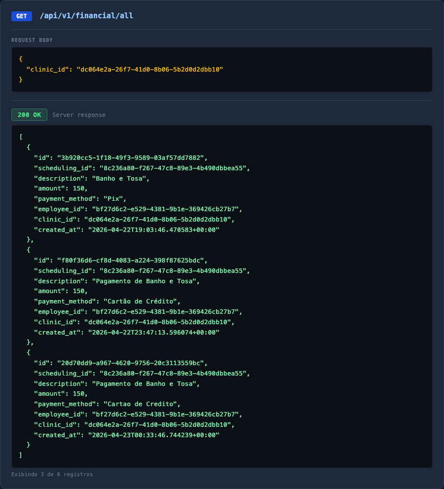
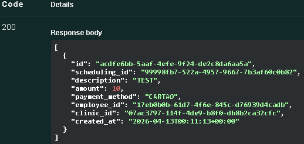

### 2. Detalhes
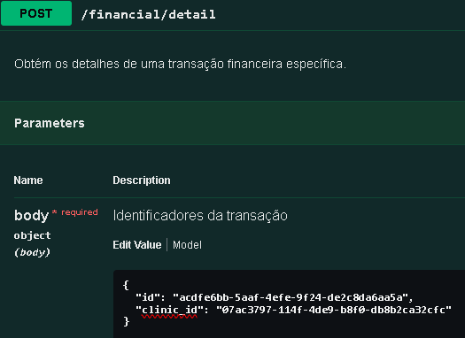
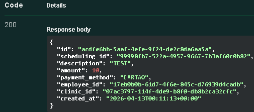

### 3. Criação
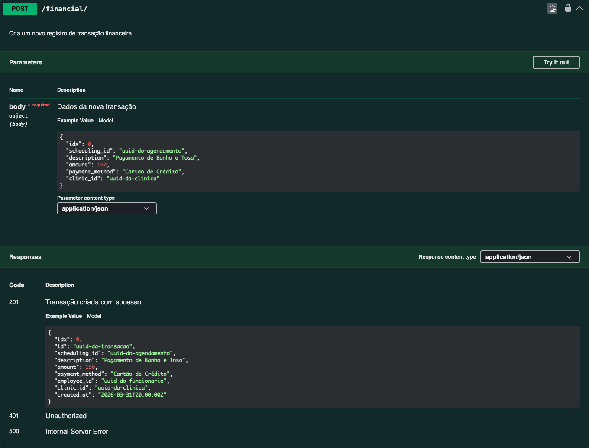
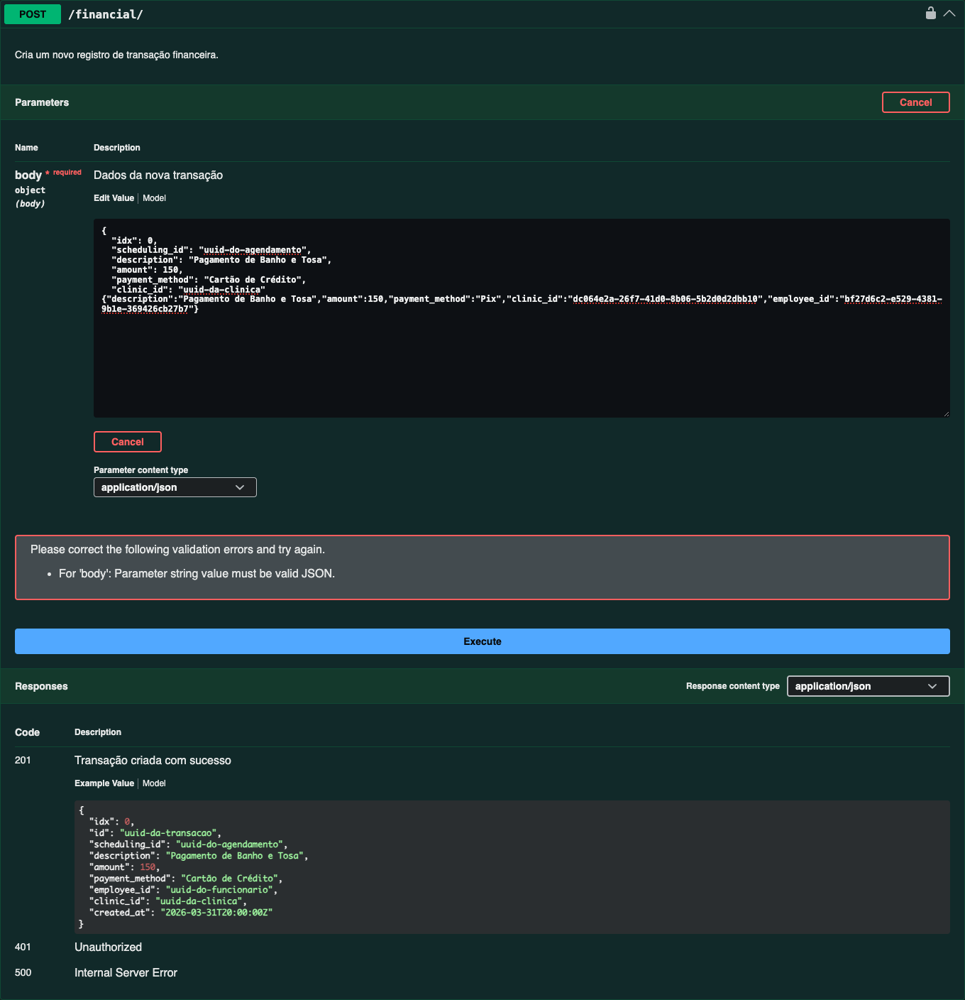

### 4. Atualização
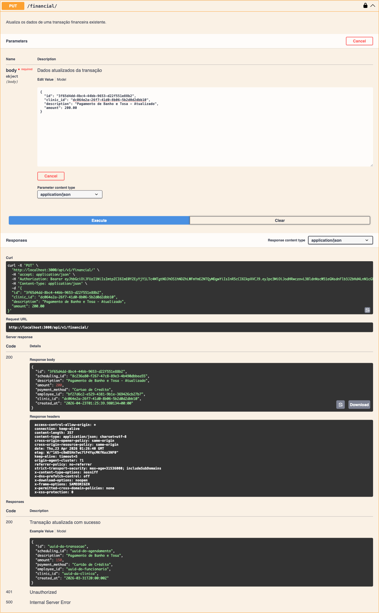
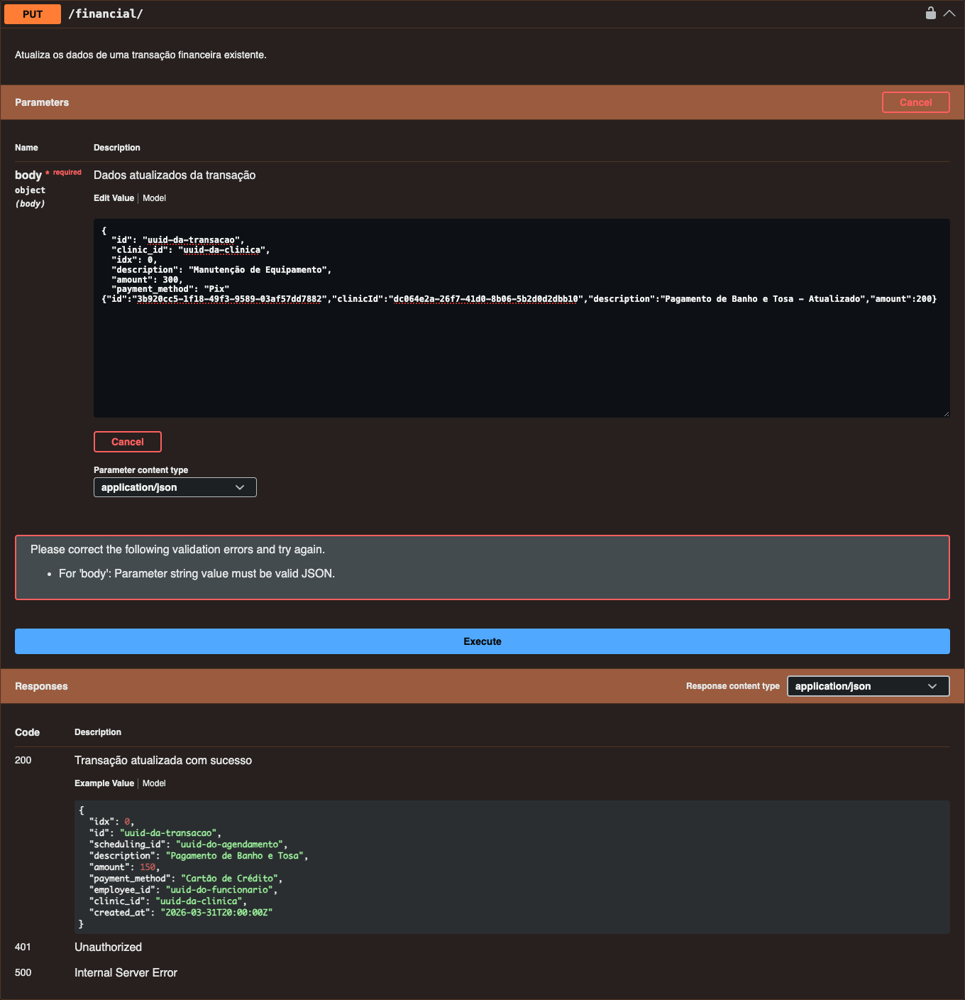

### 5. Exclusão
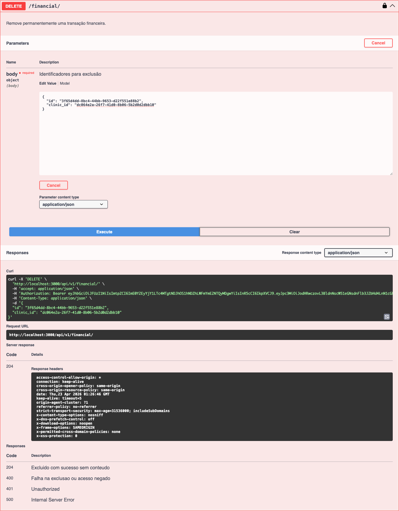
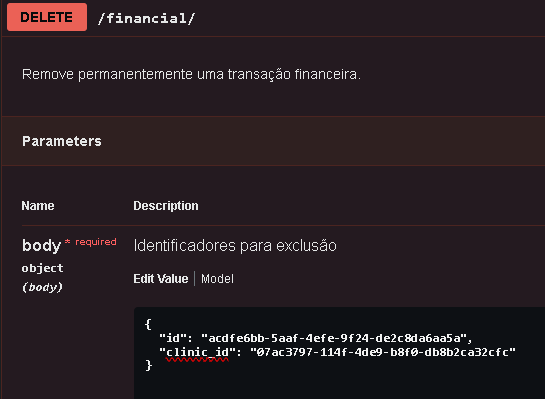

---

## Cadastro, listagem, atualização e exclusão de Produtos

Testes do módulo de produto realizados via Postman/cURL, validando o funcionamento correto das rotas, autenticação JWT e retorno das requisições.

> **Pré-requisito:** Todas as rotas de produto requerem autenticação. Obtenha o token via `POST /api/v1/auth/login` e inclua no header `Authorization: Bearer TOKEN`.

### 1. Listar todos os produtos

`GET http://localhost:3000/api/v1/product/`

```bash
curl -X GET http://localhost:3000/api/v1/product/ \
  -H "Authorization: Bearer TOKEN"
```

**Resposta esperada (200 OK):**
```json
[
  {
    "id": "uuid-do-produto",
    "name": "Ração Premium",
    "description": "Ração para cães adultos",
    "price": 89.90,
    "stock": 50,
    "category": "Alimentação",
    "createdAt": "2026-04-10T10:00:00.000Z",
    "updatedAt": "2026-04-10T10:00:00.000Z"
  }
]
```

### 2. Buscar produto por ID

`GET http://localhost:3000/api/v1/product/{id}`

```bash
curl -X GET http://localhost:3000/api/v1/product/ID_DO_PRODUTO \
  -H "Authorization: Bearer TOKEN"
```

**Resposta esperada (200 OK):**
```json
{
  "id": "uuid-do-produto",
  "name": "Ração Premium",
  "description": "Ração para cães adultos",
  "price": 89.90,
  "stock": 50,
  "category": "Alimentação",
  "createdAt": "2026-04-10T10:00:00.000Z",
  "updatedAt": "2026-04-10T10:00:00.000Z"
}
```

### 3. Criar produto

`POST http://localhost:3000/api/v1/product/`

```bash
curl -X POST http://localhost:3000/api/v1/product/ \
  -H "Content-Type: application/json" \
  -H "Authorization: Bearer TOKEN" \
  -d '{"name":"Ração Premium","description":"Ração para cães adultos","price":89.90,"stock":50,"category":"Alimentação"}'
```

Parâmetros:
- `name`: Nome do produto
- `description`: Descrição do produto
- `price`: Preço (numérico)
- `stock`: Quantidade em estoque (numérico)
- `category`: Categoria do produto

**Resposta esperada (201 Created):**
```json
{
  "id": "uuid-do-produto",
  "name": "Ração Premium",
  "description": "Ração para cães adultos",
  "price": 89.90,
  "stock": 50,
  "category": "Alimentação",
  "createdAt": "2026-04-10T10:00:00.000Z",
  "updatedAt": "2026-04-10T10:00:00.000Z"
}
```

### 4. Atualizar produto

`PUT http://localhost:3000/api/v1/product/{id}`

```bash
curl -X PUT http://localhost:3000/api/v1/product/ID_DO_PRODUTO \
  -H "Content-Type: application/json" \
  -H "Authorization: Bearer TOKEN" \
  -d '{"price":99.90,"stock":40}'
```

Parâmetros (todos opcionais):
- `name`, `description`, `price`, `stock`, `category`

**Resposta esperada (200 OK):**
```json
{
  "id": "uuid-do-produto",
  "name": "Ração Premium",
  "description": "Ração para cães adultos",
  "price": 99.90,
  "stock": 40,
  "category": "Alimentação",
  "createdAt": "2026-04-10T10:00:00.000Z",
  "updatedAt": "2026-04-22T15:00:00.000Z"
}
```

### 5. Excluir produto

`DELETE http://localhost:3000/api/v1/product/{id}`

```bash
curl -X DELETE http://localhost:3000/api/v1/product/ID_DO_PRODUTO \
  -H "Authorization: Bearer TOKEN"
```

**Resposta esperada (204 No Content):** sem corpo de resposta

## Evidências — Produtos

### 1. Listagem de produtos
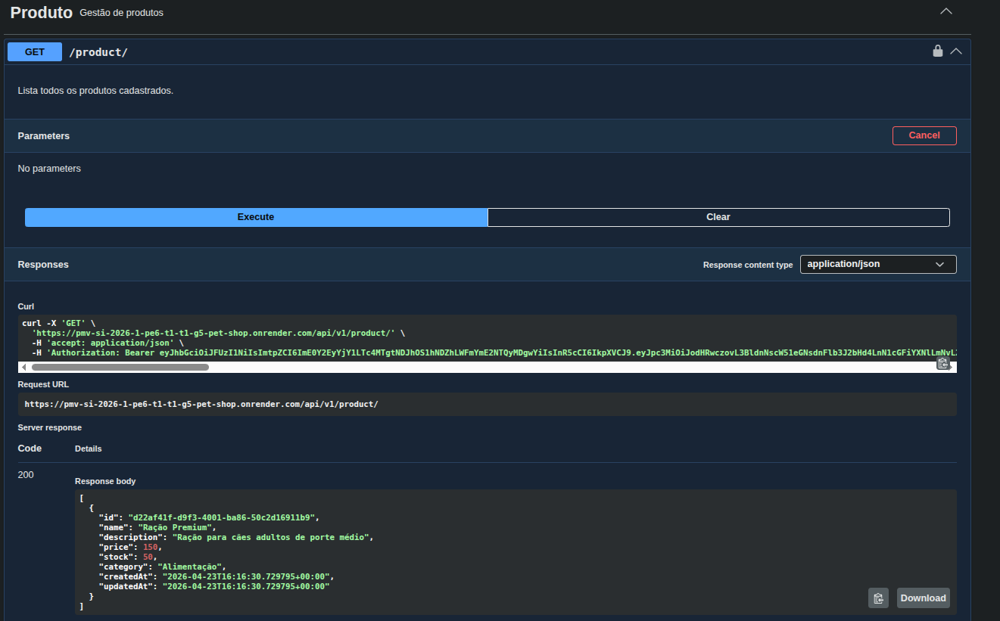

### 2. Busca por ID
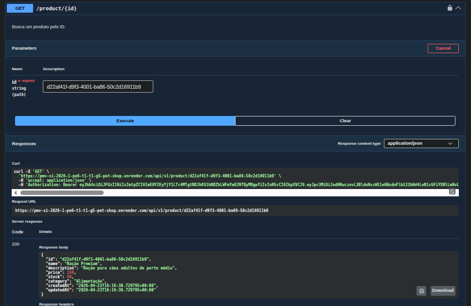

### 3. Criação de produto
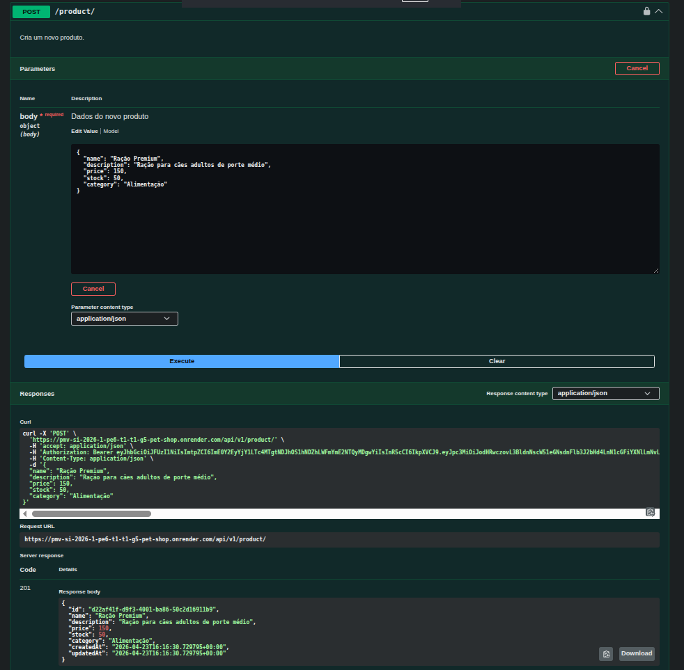

### 4. Atualização de produto
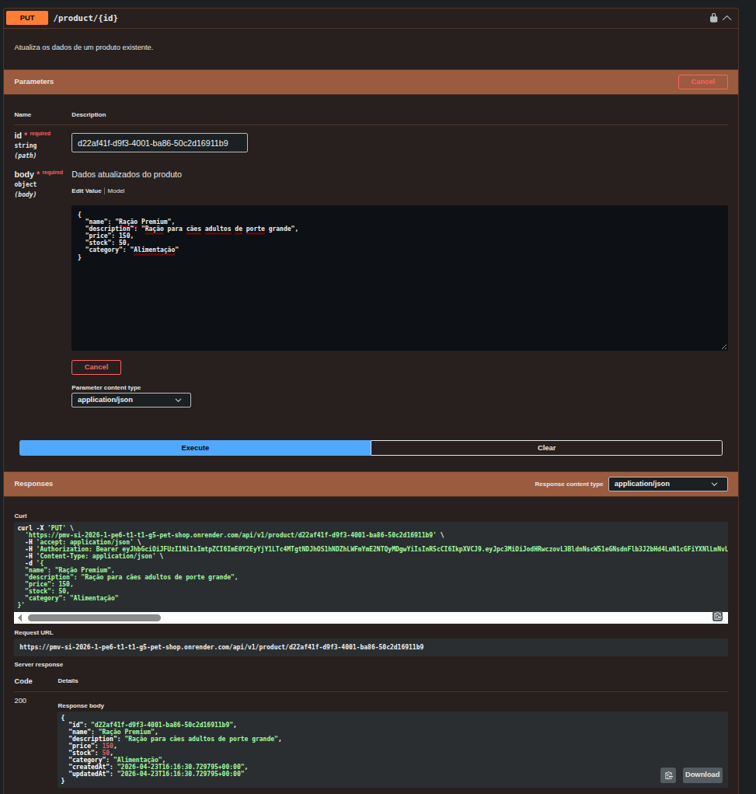

### 5. Exclusão de produto
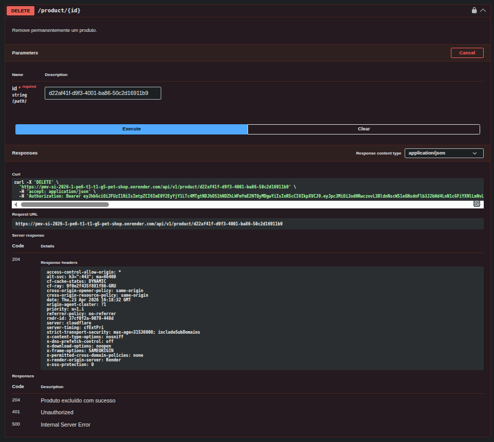

---

### Listagem, cadastro, exclusão e atualização de serviços

Demonstração do teste do módulo de Serviço realizada no Postman, validando o funcionamento das rotas e o retorno correto das requisições.

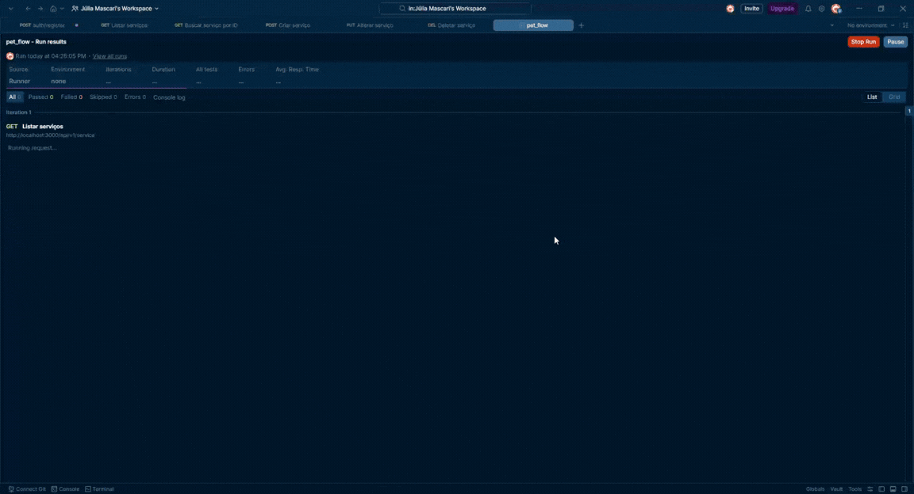

# Referências

Inclua todas as referências (livros, artigos, sites, etc) utilizados no desenvolvimento do trabalho.
