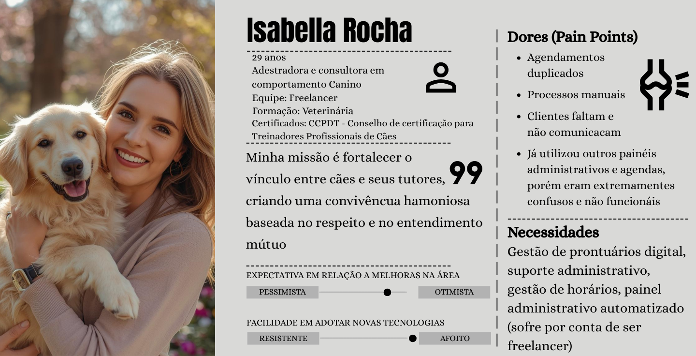
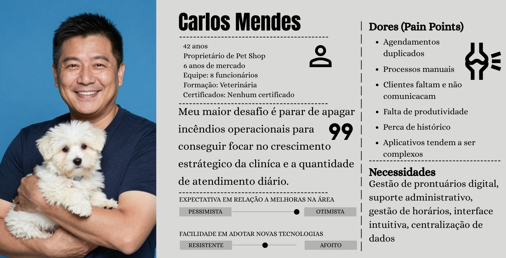
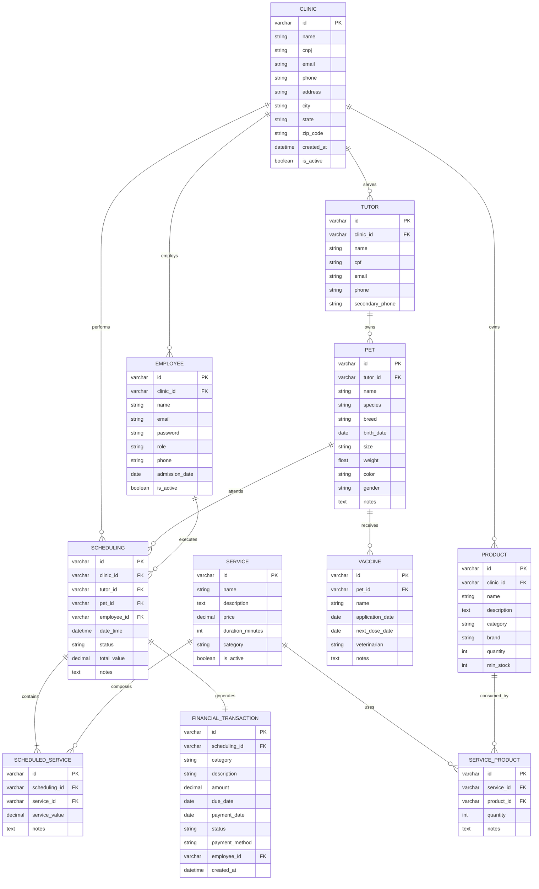
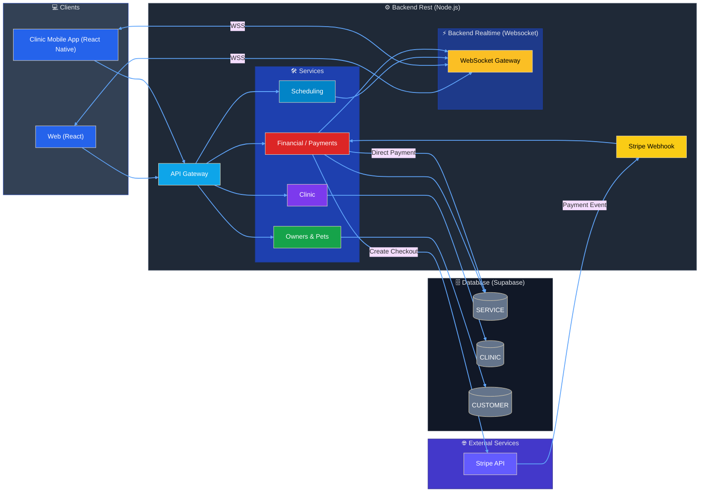
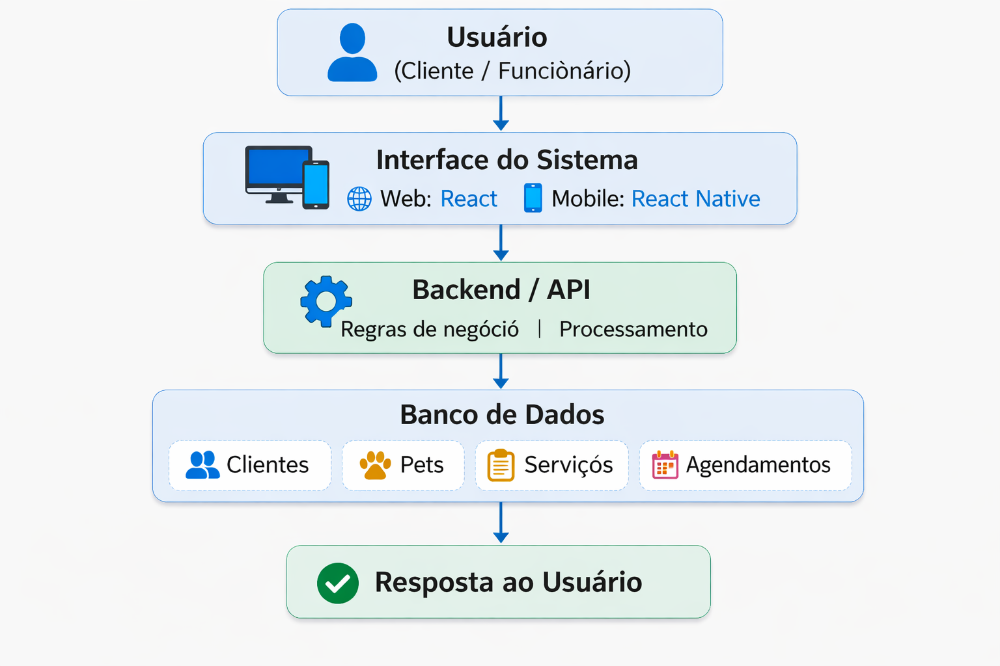

# Introdução

O mercado de produtos e serviços para animais de estimação tem apresentado crescimento constante no Brasil nas últimas décadas. Segundo dados da Associação Brasileira da Indústria de Produtos para Animais de Estimação (ABINPET), o país está entre os maiores mercados pet do mundo, impulsionado pelo aumento do número de animais de estimação e pela crescente humanização desses animais no ambiente familiar. Esse cenário tem ampliado a demanda por serviços especializados, como banho, tosa e atendimento personalizado.Apesar desse crescimento, muitos estabelecimentos do setor ainda utilizam métodos manuais ou sistemas pouco integrados para o controle de agendamentos, cadastro de clientes e gestão de serviços, o que pode gerar falhas operacionais e dificuldades administrativas. Nesse contexto, a aplicação de tecnologias da informação, especialmente por meio de sistemas distribuídos, apresenta-se como uma alternativa para modernizar e integrar os processos internos, contribuindo para maior organização e eficiência na gestão de pet shops.

## Problema
Pequenos e médios pet shops enfrentam dificuldades na organização de suas operações diárias, como controle de clientes, agendamentos de banho e tosa, registro de serviços e acompanhamento financeiro. Em muitos casos, essas informações são gerenciadas de forma manual ou por meio de ferramentas não integradas, como cadernos, planilhas e aplicativos de mensagens, o que pode gerar conflitos de horário, perda de dados e falhas na comunicação interna.

Esse cenário é comum em estabelecimentos com equipe reduzida, onde o gestor acumula funções administrativas e operacionais. A falta de organização impacta diretamente na eficiência, qualidade do atendimento e na capacidade de controle dentro do pet shop.

## Objetivos

Desenvolver um sistema de gestão integrado para um pet shop, com o objetivo de otimizar e centralizar as principais atividades operacionais e administrativas do estabelecimento. O sistema visa proporcionar maior organização, eficiência e controle dos processos internos, contemplando o gerenciamento de agendamentos, cadastro de clientes e seus respectivos pets, registro de serviços prestados e controle financeiro. Dessa forma, busca-se contribuir para a melhoria do atendimento, apoio à tomada de decisões e aumento da produtividade do negócio por meio da utilização de recursos tecnológicos adequados.

#### Objetivos Específicos

- Criar um módulo de agendamento para controle de horários de serviços como banho, tosa e demais atendimentos oferecidos pelo pet shop.
- Desenvolver um sistema de cadastro de clientes, contendo informações pessoais e de contato dos responsáveis pelos animais.
- Implementar um cadastro de pets, permitindo o registro de dados como nome, espécie, raça, idade e histórico de serviços realizados.
- Garantir a organização, integridade e segurança das informações armazenadas no sistema.

## Justificativa

O setor pet brasileiro figura entre os maiores do mundo e vem crescendo de forma expressiva nos últimos anos. Segundo dados da Associação Brasileira da Indústria de Produtos para Animais de Estimação (Abinpet), o Brasil encerrou 2024 com faturamento de R$ 75,4 bilhões no segmento, alta de 9,6% frente ao ano anterior, com projeção de alcançar R$ 77,2 bilhões em 2025 (ABINPET; IPB, 2024). Em termos de população animal, o país reúne aproximadamente 160,9 milhões de pets, ocupando a terceira posição no ranking mundial, atrás apenas dos Estados Unidos e da China (CRMV-PB, 2024).

Esse crescimento impulsiona a demanda por serviços especializados, como banho, tosa, veterinária e hotelaria, aumentando o volume de operações que os estabelecimentos precisam administrar no dia a dia. Ainda assim, grande parte dos pet shops segue operando de forma manual ou com ferramentas pouco integradas, recorrendo a cadernos, planilhas e aplicativos de mensagens para controlar agendamentos, cadastros e serviços. Esse modelo de gestão tende a gerar conflitos de horário, perda de histórico de atendimentos e sobrecarga sobre o gestor, que muitas vezes acumula tarefas administrativas e operacionais ao mesmo tempo (PETSHOPCONTROL, 2023).

Do lado do cliente, a ausência de um sistema centralizado também se faz sentir: confirmações que não chegam, dificuldade em saber o status do serviço e atendimentos que dependem exclusivamente da disponibilidade telefônica do estabelecimento. Em um setor cada vez mais disputado, esses detalhes têm peso direto na retenção de clientes.

O Pet Flow surge como resposta a esse cenário. Trata-se de uma aplicação distribuída que integra backend, interface web e mobile com o objetivo de centralizar as informações operacionais do pet shop em tempo real, permitindo que gestores e equipes acessem e atualizem dados de qualquer dispositivo. A escolha por uma arquitetura distribuída não é meramente técnica: ela reflete a realidade de um ambiente onde recepcionistas, tosadores e gestores precisam consultar e registrar informações simultaneamente, a partir de pontos distintos, o que torna inviável qualquer solução que não contemple essa natureza concorrente e distribuída das operações.

Mais do que uma ferramenta de digitalização, o Pet Flow se propõe a reduzir o retrabalho administrativo e devolver ao gestor e à equipe mais tempo e atenção para o atendimento em si.

## Público-Alvo

### 1. Definição Geral
O público-alvo do Pet Flow são pet shops que enfrentam dificuldade na organização de agendamento, controle de serviços (banho e tosa), gestão de clientes e acompanhamento da carga diária de trabalho. Gerando uma maior dificuldade no controle e gestão operacional, portando o Pet Flow busca centralizar as informações e oferecer um controle muito mais simplificado para os pet shops.

### 2. Segmentação

#### 2.1 Segmentação Firmográfica (B2B)
- Tipo de empresa: Pet Shop
- Porte: Qualquer porte de empresa (pequeno, médio e grande)
- Estrutura atual: Gestão manual ou uso de planilhas

#### 2.2 Segmentação Comportamental
- Usa WhatsApp ou telefone para agendamentos
- Possui agenda física ou planilha Excel
- Não possui dashboard operacional
- Tem dificuldade em visualizar:
  - Quantos atendimentos faltam no dia
  - Próximo atendimento
  - Serviços já concluídos
- Perde tempo com retrabalho administrativo

#### 2.3 Segmentação Psicográfica
- Empresário prático
- Focado em produtividade
- Busca organização e previsibilidade
- Sensível a custo, mas valoriza eficiência

### 3. Personas

### 3.1 Isabella Rocha

### 3.2 Carlos Mendes

# Especificações do Projeto

## Requisitos

As tabelas que se seguem apresentam os requisitos funcionais e não funcionais que detalham o escopo do projeto. Para determinar a prioridade de requisitos, aplicar uma técnica de priorização de requisitos e detalhar como a técnica foi aplicada.

### Requisitos Funcionais

|ID    | Descrição do Requisito  | Prioridade |
|------|-----------------------------------------|----|
|RF-001| Cadastro e login de usuários | ALTA |
|RF-002| Cadastro, edição e exclusão de clientes  | ALTA |
|RF-003| Cadastro, edição e exclusão de pets  | ALTA |
|RF-004| Cadastro, edição e exclusão de serviços | ALTA |
|RF-005| Realizar, editar e cancelar agendamentos | ALTA |
|RF-006| Controle de entrada e saída de estoque   | MÉDIA |
|RF-007| Registro de receitas e despesas | MÉDIA |

### Requisitos não Funcionais

|ID     | Descrição do Requisito  |Prioridade |
|-------|-------------------------|----|
|RNF-001| O sistema deve ser desenvolvido utilizando uma arquitetura de microserviços (ou módulos desacoplados) para permitir atualizações independentes de cada componente | ALTA | 
|RNF-002|O sistema deve garantir a segurança das informações através da criptografia de dados sensíveis e assegurar a disponibilidade do serviço para os usuários finais |  ALTA | 
|RNF-003| A interface deve ser totalmente responsiva, garantindo a mesma experiência de usuário em resoluções de desktop, tablets e smartphones |  MÉDIA | 
|RNF-004| O acesso às funcionalidades do sistema deve ser restrito através de login e senha para cada tipo de usuário |  ALTA | 
|RNF-005| As respostas das consultas devem ser exibidas em até 5 segundos, caso o processamento exceda esse tempo irá exibir uma mensagem de erro  |  MÉDIA | 

## Restrições

O projeto está restrito pelos itens apresentados na tabela a seguir.

|ID| Restrição                                             |
|--|-------------------------------------------------------|
| 01 | O projeto deverá ser desenvolvido e entregue dentro do prazo definido pelo cronograma acadêmico da disciplina, até o final do semestre letivo.                                              |
| 02 | O escopo do projeto não contempla a emissão automatizada de notas fiscais eletrônicas (NF-e/NFS-e) ou integração direta com sistemas da Secretaria da Fazenda nesta versão inicial.         |
| 03 | A interface do sistema deverá ser desenvolvida utilizando JavaScript e tecnologias web padrão, não sendo permitido o uso de plataformas de criação de sites prontos, como Wix ou WordPress. |
| 04 | O controle de estoque será limitado ao registro interno de entradas e saídas de produtos, não incluindo integração automática com fornecedores ou sistemas externos de reposição.           |
| 05 | É obrigatório o uso de uma ferramenta de controle de versão, como Git e GitHub, para gerenciamento do código-fonte e histórico de desenvolvimento do projeto.                               |
| 06 | O sistema será disponibilizado apenas no idioma Português do Brasil, não contemplando suporte nativo a múltiplos idiomas nesta versão.                                                      |
| 07 | A infraestrutura de hospedagem poderá utilizar serviços gratuitos ou de baixo custo, o que pode limitar recursos de desempenho, escalabilidade ou armazenamento.                            |

# Catálogo de Serviços

## 1. Autenticação de Usuários

**Descrição**
Responsável por permitir que funcionários da clínica se cadastrem e acessem o sistema, garantindo acesso às funcionalidades de acordo com seu perfil.

**Funcionalidades**

* Cadastro de novos usuários vinculados à clínica
* Autenticação por meio de e-mail e senha
* Controle de acesso ao sistema conforme grau de autorização

---

## 2. Gestão de Clientes (Tutores)

**Descrição**
Permite o gerenciamento das informações dos tutores, que são os responsáveis pelos pets atendidos na clínica.

**Funcionalidades**

* Cadastro de novos tutores
* Edição e exclusão de informações cadastrais
* Consulta de tutores cadastrados

---

## 3. Gestão de Pets

**Descrição**
Cadastro e gerenciamento dos pets vinculados aos tutores. Permite registrar informações relevantes sobre os animais para facilitar o atendimento.

**Funcionalidades**

* Cadastro de pets associados a um tutor
* Edição e exclusão das informações do pet
* Consulta de dados do animal

---

## 4. Gestão de Serviços

**Descrição**
Permite o cadastro e gerenciamento dos serviços oferecidos pelo pet shop, possibilitando organizar os atendimentos disponíveis para agendamento.

**Funcionalidades**

* Cadastro de serviços oferecidos pela clínica
* Definição de preço, descrição e duração estimada do serviço
* Edição, ativação ou desativação dos serviços cadastrados

---

## 5. Agendamento de Atendimentos

**Descrição**
Gerenciamento dos agendamentos realizados para os pets. Permite organizar os horários de atendimento e acompanhar o status de cada agendamento.

**Funcionalidades**

* Criação de novos agendamentos
* Associação de pet, tutor, serviço e profissional responsável
* Alteração, cancelamento ou atualização do status do agendamento

---

## 6. Controle de Estoque

**Descrição**
Permite o controle dos produtos utilizados, auxiliando na gestão das quantidades disponíveis e na reposição de itens necessários.

**Funcionalidades**

* Cadastro de produtos no sistema
* Registro de entradas e saídas de produtos no estoque
* Consulta do estoque disponível

---

## 7. Gestão Financeira

**Descrição**
Responsável pelo registro e acompanhamento das movimentações financeiras da clínica, permitindo controlar receitas provenientes de serviços e despesas operacionais.

**Funcionalidades**

* Registro de receitas e despesas da clínica
* Consulta do histórico de movimentações financeiras
* Atualização do status de pagamento das transações

# Arquitetura da Solução

## Diagrama de Entidade Relacionamento (ERD)

## Detalhe das tabelas

### 1. Tabela `CLINIC`

Armazena informações das clínicas/pet shops do sistema.

| Campo | Tipo | Restrições | Descrição |
|-------|------|-------------|-------------|
| id | VARCHAR(36) | PK | Identificador único (UUID) |
| name | VARCHAR(100) | NOT NULL | Nome da clínica |
| cnpj | VARCHAR(18) | UNIQUE | CNPJ |
| email | VARCHAR(100) | | E-mail |
| phone | VARCHAR(15) | | Telefone |
| address | VARCHAR(200) | | Endereço |
| city | VARCHAR(50) | | Cidade |
| state | VARCHAR(2) | | Estado |
| zip_code | VARCHAR(9) | | CEP |
| created_at | DATETIME | NOT NULL, DEFAULT CURRENT_TIMESTAMP | Data de cadastro |
| is_active | BOOLEAN | NOT NULL, DEFAULT TRUE | Status da clínica |

---

### 2. Tabela `TUTOR`

Armazena informações dos tutores (donos) dos pets.

| Campo | Tipo | Restrições | Descrição |
|-------|------|-------------|-------------|
| id | VARCHAR(36) | PK | Identificador único (UUID) |
| clinic_id | VARCHAR(36) | FK, NOT NULL | Referência para a clínica |
| name | VARCHAR(100) | NOT NULL | Nome completo |
| cpf | VARCHAR(14) | UNIQUE | CPF |
| email | VARCHAR(100) | | E-mail |
| phone | VARCHAR(15) | NOT NULL | Telefone |
| secondary_phone | VARCHAR(15) | | Telefone secundário |

---

### 3. Tabela `PET`

Armazena informações dos pets vinculados aos tutores.

| Campo | Tipo | Restrições | Descrição |
|-------|------|-------------|-------------|
| id | VARCHAR(36) | PK | Identificador único (UUID) |
| tutor_id | VARCHAR(36) | FK, NOT NULL | Referência para o tutor |
| name | VARCHAR(50) | NOT NULL | Nome do pet |
| species | VARCHAR(30) | NOT NULL | Espécie (Cachorro, Gato, etc.) |
| breed | VARCHAR(50) | | Raça |
| birth_date | DATE | | Data de nascimento |
| size | VARCHAR(20) | | Porte (Pequeno, Médio, Grande) |
| weight | DECIMAL(5,2) | | Peso em kg |
| color | VARCHAR(30) | | Cor da pelagem |
| gender | CHAR(1) | | M (Macho) / F (Fêmea) |
| notes | TEXT | | Observações médicas/comportamentais |

---

### 4. Tabela `VACCINE`

Armazena o histórico de vacinação dos pets.

| Campo | Tipo | Restrições | Descrição |
|-------|------|-------------|-------------|
| id | VARCHAR(36) | PK | Identificador único (UUID) |
| pet_id | VARCHAR(36) | FK, NOT NULL | Referência para o pet |
| name | VARCHAR(100) | NOT NULL | Nome da vacina |
| application_date | DATE | NOT NULL | Data de aplicação |
| next_dose_date | DATE | | Data da próxima dose |
| veterinarian | VARCHAR(100) | | Nome do veterinário |
| notes | TEXT | | Observações adicionais |

---

### 5. Tabela `EMPLOYEE`

Armazena os usuários do sistema (funcionários) vinculados à clínica.

| Campo | Tipo | Restrições | Descrição |
|-------|------|-------------|-------------|
| id | VARCHAR(36) | PK | Identificador único (UUID) |
| clinic_id | VARCHAR(36) | FK, NOT NULL | Referência para a clínica |
| name | VARCHAR(100) | NOT NULL | Nome completo |
| email | VARCHAR(100) | UNIQUE, NOT NULL | E-mail (login) |
| password | VARCHAR(255) | NOT NULL | Senha criptografada |
| role | VARCHAR(30) | NOT NULL | Função no sistema |
| phone | VARCHAR(15) | | Telefone de contato |
| admission_date | DATE | | Data de admissão |
| is_active | BOOLEAN | NOT NULL, DEFAULT TRUE | Status do funcionário |

---

### 6. Tabela `SERVICE`

Armazena os serviços oferecidos pelo pet shop.

| Campo | Tipo | Restrições | Descrição |
|-------|------|-------------|-------------|
| id | VARCHAR(36) | PK | Identificador único (UUID) |
| name | VARCHAR(100) | NOT NULL | Nome do serviço |
| description | TEXT | | Descrição detalhada |
| price | DECIMAL(10,2) | NOT NULL | Preço |
| duration_minutes | INT | | Duração estimada em minutos |
| category | VARCHAR(30) | NOT NULL | Categoria do serviço |
| is_active | BOOLEAN | NOT NULL, DEFAULT TRUE | Status do serviço |

---

### 7. Tabela `SERVICE_PRODUCT` (Tabela de Junção)

Relaciona serviços com os produtos que utilizam (N:N).

| Campo | Tipo | Restrições | Descrição |
|-------|------|-------------|-------------|
| id | VARCHAR(36) | PK | Identificador único (UUID) |
| service_id | VARCHAR(36) | FK, NOT NULL | Referência para o serviço |
| product_id | VARCHAR(36) | FK, NOT NULL | Referência para o produto |
| quantity | INT | NOT NULL | Quantidade utilizada no serviço |
| notes | TEXT | | Observações sobre o uso do produto |

---

### 8. Tabela `PRODUCT`

Controla o estoque de produtos da clínica.

| Campo | Tipo | Restrições | Descrição |
|-------|------|-------------|-------------|
| id | VARCHAR(36) | PK | Identificador único (UUID) |
| clinic_id | VARCHAR(36) | FK, NOT NULL | Referência para a clínica |
| name | VARCHAR(100) | NOT NULL | Nome do produto |
| description | TEXT | | Descrição detalhada |
| category | VARCHAR(30) | NOT NULL | Categoria do produto |
| brand | VARCHAR(50) | | Marca |
| quantity | INT | NOT NULL, DEFAULT 0 | Quantidade |
| min_stock | INT | NOT NULL, DEFAULT 0 | Estoque mínimo para alerta |

---

### 9. Tabela `SCHEDULING`

Registra os agendamentos de serviços realizados pela clínica.

| Campo | Tipo | Restrições | Descrição |
|-------|------|-------------|-------------|
| id | VARCHAR(36) | PK | Identificador único (UUID) |
| clinic_id | VARCHAR(36) | FK, NOT NULL | Clínica responsável |
| tutor_id | VARCHAR(36) | FK, NOT NULL | Tutor solicitante |
| pet_id | VARCHAR(36) | FK, NOT NULL | Pet a ser atendido |
| employee_id | VARCHAR(36) | FK, NOT NULL | Profissional responsável |
| date_time | DATETIME | NOT NULL | Data e hora do agendamento |
| status | VARCHAR(20) | NOT NULL | Status do agendamento |
| total_value | DECIMAL(10,2) | NOT NULL | Valor total do agendamento |
| notes | TEXT | | Observações gerais |

**Status Possíveis:**
- `Agendado` - Agendamento criado
- `Confirmado` - Confirmado pelo tutor
- `Em Andamento` - Serviço em execução
- `Concluído` - Serviço finalizado
- `Cancelado` - Agendamento cancelado

---

### 10. Tabela `SCHEDULED_SERVICE` (Tabela de Junção)

Relaciona agendamentos com serviços (N:N).

| Campo | Tipo | Restrições | Descrição |
|-------|------|-------------|-------------|
| id | VARCHAR(36) | PK | Identificador único (UUID) |
| scheduling_id | VARCHAR(36) | FK, NOT NULL | Referência para o agendamento |
| service_id | VARCHAR(36) | FK, NOT NULL | Referência para o serviço |
| service_value | DECIMAL(10,2) | NOT NULL | Valor do serviço no momento do agendamento |
| notes | TEXT | | Observações específicas do serviço |

---

### 11. Tabela `FINANCIAL_TRANSACTION`

Registra receitas e despesas do pet shop (uma por agendamento).

| Campo | Tipo | Restrições | Descrição |
|-------|------|-------------|-------------|
| id | VARCHAR(36) | PK | Identificador único (UUID) |
| scheduling_id | VARCHAR(36) | FK, UNIQUE, NOT NULL | Agendamento relacionado (único) |
| category | VARCHAR(50) | NOT NULL | Categoria da transação |
| description | VARCHAR(200) | NOT NULL | Descrição detalhada |
| amount | DECIMAL(10,2) | NOT NULL | Valor da transação |
| due_date | DATE | | Data de vencimento |
| payment_date | DATE | | Data do pagamento |
| status | VARCHAR(20) | NOT NULL | Status do pagamento |
| payment_method | VARCHAR(20) | | Forma de pagamento |
| employee_id | VARCHAR(36) | FK, NOT NULL | Funcionário responsável |
| created_at | DATETIME | NOT NULL, DEFAULT CURRENT_TIMESTAMP | Data de criação |

**Status Possíveis:**
- `Pendente` - Aguardando pagamento
- `Pago` - Pagamento realizado
- `Cancelado` - Transação cancelada

---
### 12. Design do Sistema:

## Tecnologias Utilizadas

O desenvolvimento do sistema Pet Flow será realizado utilizando tecnologias voltadas para aplicações web e mobile, permitindo a criação de uma plataforma acessível em diferentes dispositivos e capaz de centralizar as informações operacionais do pet shop.A interface web será desenvolvida utilizando HTML, CSS e JavaScript, com o apoio da biblioteca React, responsável pela construção da interface do usuário por meio de componentes reutilizáveis e pela criação de uma experiência mais dinâmica e interativa.Para a aplicação mobile, será utilizado o framework React Native, que permite o desenvolvimento de aplicativos móveis utilizando JavaScript. A versão mobile irá reutilizar o mesmo backend da aplicação web, permitindo que ambas as plataformas compartilhem a mesma lógica de negócio e acesso aos dados do sistema.O desenvolvimento do código será realizado utilizando a IDE Visual Studio Code, amplamente utilizada no desenvolvimento de aplicações web. Para o controle de versões e gerenciamento do código-fonte será utilizado o GitHub, possibilitando o acompanhamento das alterações realizadas durante o desenvolvimento do projeto.Essa combinação de tecnologias permite a construção de uma aplicação moderna, modular e acessível, facilitando a manutenção do sistema e possibilitando a integração entre as versões web e mobile do Pet Flow.

## Hospedagem
A hospedagem do sistema Pet Flow será realizada utilizando serviços de computação em nuvem com planos gratuitos, adequados ao contexto do projeto.
O frontend da aplicação será hospedado na plataforma Vercel, permitindo que os usuários acessem o sistema por meio do navegador de forma rápida e segura.
O backend da API REST, responsável pelas regras de negócio e pela comunicação com o banco de dados, também será hospedado na Vercel, aproveitando os recursos de funções serverless da plataforma.
Já o backend responsável pela comunicação em tempo real via WebSocket será hospedado na Render, garantindo maior estabilidade para conexões persistentes entre o servidor e os clientes.
O banco de dados será hospedado no Supabase, um serviço gerenciado que oferece banco PostgreSQL, autenticação e outras funcionalidades úteis para o desenvolvimento da aplicação.
Todo o código do projeto será armazenado e versionado no GitHub, permitindo controle de versões, colaboração entre os membros da equipe e atualização contínua da aplicação.
Essa arquitetura permite que o sistema funcione de forma distribuída, escalável e acessível pela internet, possibilitando que diferentes usuários utilizem o sistema simultaneamente.

## Referência
Introdução
- https://abinpet.org.br/dados-de-mercado
- https://www.abre.org.br/inovacao/mercado-pet-movimenta-r-754-bilhoes-em-2024-e-segue-em-expansao-no-brasil
- https://www.abre.org.br/inovacao/mercado-pet-movimenta-r-754-bilhoes-em-2024-e-segue-em-expansao-no-brasil
- https://zipdo.co/brazil-pet-industry-statistics/
- https://mermaid.js.org/intro/syntax-reference.html
- ABINPET; IPB. *Release 3º Trimestre 2024*. Disponível em: https://www.gov.br/agricultura/pt-br/assuntos/camaras-setoriais-tematicas/documentos/camaras-setoriais/animais-e-estimacao/2024/41a-ro-05-11-2024/release_3trimestre_abinpet_ipb_2024.pdf. Acesso em: mar. 2026.
- CRMV-PB. *Brasil ocupa o 3º lugar no ranking mundial de países com mais animais domésticos*. Disponível em: https://www.crmvpb.org.br/29077-2/. Acesso em: mar. 2026.
- PETSHOPCONTROL. *7 dificuldades do empreendedor no mercado pet*. Disponível em: https://www.petshopcontrol.com.br/blog/dificuldades-empreendedor-mercado-pet/. Acesso em: mar. 2026.
- https://archive.org/details/sommerville-engenharia-de-software-10e
