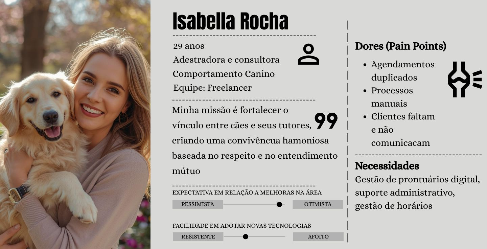
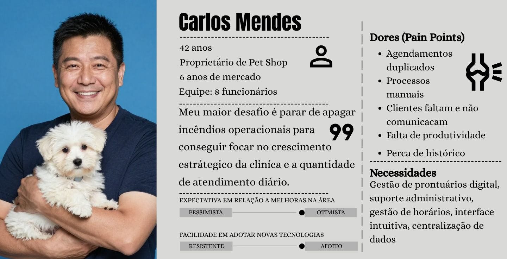

# Introdução

Os animais de estimação estão cada vez mais sendo considerados parte da família, o que aumenta a busca por serviços de qualidade em pet shops. Com esse crescimento, surge a necessidade de organizar melhor clientes, agendamentos e serviços como banho e tosa.Muitos estabelecimentos ainda enfrentam problemas como desorganização, falhas nos agendamentos e dificuldade no controle das informações. Para resolver isso, o projeto propõe o desenvolvimento de um sistema distribuído que integra clientes, serviços e horários em tempo real, facilitando a gestão do negócio.O objetivo é tornar o funcionamento do pet shop mais eficiente, reduzir erros e melhorar o atendimento. A justificativa do projeto está no crescimento do setor pet e na necessidade de oferecer um serviço mais organizado e moderno.Nosso público-alvo são proprietários e funcionários de pet shops que desejam melhorar a administração do estabelecimento, além dos tutores de animais que buscam um atendimento mais ágil e de qualidade.

## Problema
Pequenos e médios pet shops enfrentam dificuldades na organização de suas operações diárias, como controle de clientes, agendamentos de banho e tosa, registro de serviços e acompanhamento financeiro. Em muitos casos, essas informações são gerenciadas de forma manual ou por meio de ferramentas não integradas, como cadernos, planilhas e aplicativos de mensagens, o que pode gerar conflitos de horário, perda de dados e falhas na comunicação interna.

Esse cenário é comum em estabelecimentos com equipe reduzida, onde o gestor acumula funções administrativas e operacionais. A falta de organização impacta diretamente na eficiência, qualidade do atendimento e na capacidade de controle dentro do pet shop.
## Objetivos

Aqui você deve descrever os objetivos do trabalho indicando que o objetivo geral é desenvolver um software para solucionar o problema apresentado acima. 

Apresente também alguns (pelo menos 2) objetivos específicos dependendo de onde você vai querer concentrar a sua prática investigativa, ou como você vai aprofundar no seu trabalho.
 
> **Links Úteis**:
> - [Objetivo geral e objetivo específico: como fazer e quais verbos utilizar](https://blog.mettzer.com/diferenca-entre-objetivo-geral-e-objetivo-especifico/)

## Justificativa

O setor pet brasileiro figura entre os maiores do mundo e vem crescendo de forma expressiva nos últimos anos. Segundo dados da Associação Brasileira da Indústria de Produtos para Animais de Estimação (Abinpet), o Brasil encerrou 2024 com faturamento de R$ 75,4 bilhões no segmento, alta de 9,6% frente ao ano anterior, com projeção de alcançar R$ 77,2 bilhões em 2025 (ABINPET; IPB, 2024). Em termos de população animal, o país reúne aproximadamente 160,9 milhões de pets, ocupando a terceira posição no ranking mundial, atrás apenas dos Estados Unidos e da China (CRMV-PB, 2024).

Esse crescimento impulsiona a demanda por serviços especializados, como banho, tosa, veterinária e hotelaria, aumentando o volume de operações que os estabelecimentos precisam administrar no dia a dia. Ainda assim, grande parte dos pet shops segue operando de forma manual ou com ferramentas pouco integradas, recorrendo a cadernos, planilhas e aplicativos de mensagens para controlar agendamentos, cadastros e serviços. Esse modelo de gestão tende a gerar conflitos de horário, perda de histórico de atendimentos e sobrecarga sobre o gestor, que muitas vezes acumula tarefas administrativas e operacionais ao mesmo tempo (PETSHOPCONTROL, 2023).

Do lado do cliente, a ausência de um sistema centralizado também se faz sentir: confirmações que não chegam, dificuldade em saber o status do serviço e atendimentos que dependem exclusivamente da disponibilidade telefônica do estabelecimento. Em um setor cada vez mais disputado, esses detalhes têm peso direto na retenção de clientes.

O Pet Flow surge como resposta a esse cenário. Trata-se de uma aplicação distribuída que integra backend, interface web e mobile com o objetivo de centralizar as informações operacionais do pet shop em tempo real, permitindo que gestores e equipes acessem e atualizem dados de qualquer dispositivo. A escolha por uma arquitetura distribuída não é meramente técnica: ela reflete a realidade de um ambiente onde recepcionistas, tosadores e gestores precisam consultar e registrar informações simultaneamente, a partir de pontos distintos, o que torna inviável qualquer solução que não contemple essa natureza concorrente e distribuída das operações.

Mais do que uma ferramenta de digitalização, o Pet Flow se propõe a reduzir o retrabalho administrativo e devolver ao gestor e à equipe mais tempo e atenção para o atendimento em si.

**Referências:**
- ABINPET; IPB. *Release 3º Trimestre 2024*. Disponível em: https://www.gov.br/agricultura/pt-br/assuntos/camaras-setoriais-tematicas/documentos/camaras-setoriais/animais-e-estimacao/2024/41a-ro-05-11-2024/release_3trimestre_abinpet_ipb_2024.pdf. Acesso em: mar. 2026.
- CRMV-PB. *Brasil ocupa o 3º lugar no ranking mundial de países com mais animais domésticos*. Disponível em: https://www.crmvpb.org.br/29077-2/. Acesso em: mar. 2026.
- PETSHOPCONTROL. *7 dificuldades do empreendedor no mercado pet*. Disponível em: https://www.petshopcontrol.com.br/blog/dificuldades-empreendedor-mercado-pet/. Acesso em: mar. 2026.

## Público-Alvo

### 1. Definição Geral
O público-alvo do Pet Flow são pet shops que enfrentam dificuldade na organização de agendamento, controle de serviços (banho e tosa), gestão de clientes e acompanhamento da carga diária de trabalho. Gerando uma maior dificuldade no controle e gestão operacional, portando o Pet Flow busca centralizar as informações e oferecer um controle muito mais simplificado para os pet shops.

### 2. Segmentação

#### 2.1 Segmentação Firmográfica (B2B)
- Tipo de empresa: Pet Shop
- Porte: Qualquer porte de empresa (pequeno, médio e grande)
- Estrutura atual: Gestão manual ou uso de planilhas

#### 2.2 Segmentação Comportamental
- Usa WhatsApp ou telefone para agendamentos
- Possui agenda física ou planilha Excel
- Não possui dashboard operacional
- Tem dificuldade em visualizar:
  - Quantos atendimentos faltam no dia
  - Próximo atendimento
  - Serviços já concluídos
- Perde tempo com retrabalho administrativo

#### 2.3 Segmentação Psicográfica
- Empresário prático
- Focado em produtividade
- Busca organização e previsibilidade
- Sensível a custo, mas valoriza eficiência

### 3. Personas

### 3.1 Isabella Rocha

### 3.2 Carlos Mendes

# Especificações do Projeto

## Requisitos

As tabelas que se seguem apresentam os requisitos funcionais e não funcionais que detalham o escopo do projeto. Para determinar a prioridade de requisitos, aplicar uma técnica de priorização de requisitos e detalhar como a técnica foi aplicada.

### Requisitos Funcionais

|ID    | Descrição do Requisito  | Prioridade |
|------|-----------------------------------------|----|
|RF-001| Cadastro e login de usuários | ALTA | 
|RF-002| Cadastro, edição e exclusão de clientes  | ALTA |
|RF-003| Cadastro, edição e exclusão de pets  | ALTA |
|RF-004| Cadastro, edição e exclusão de serviços | ALTA |
|RF-005| Realizar, editar e cancelar agendamentos | ALTA |
|RF-006| Controle de entrada e saída de estoque   | MÉDIA |
|RF-007| Registro de receitas e despesas | MÉDIA |

### Requisitos não Funcionais

|ID     | Descrição do Requisito  |Prioridade |
|-------|-------------------------|----|
|RNF-001| O Pet Flow deve ser responsivo para rodar em um dispositivos móvel | MÉDIA | 
|RNF-002| Deve processar requisições do usuário em no máximo 3s |  BAIXA | 

Com base nas Histórias de Usuário, enumere os requisitos da sua solução. Classifique esses requisitos em dois grupos:

- [Requisitos Funcionais
 (RF)](https://pt.wikipedia.org/wiki/Requisito_funcional):
 correspondem a uma funcionalidade que deve estar presente na
  plataforma (ex: cadastro de usuário).
- [Requisitos Não Funcionais
  (RNF)](https://pt.wikipedia.org/wiki/Requisito_n%C3%A3o_funcional):
  correspondem a uma característica técnica, seja de usabilidade,
  desempenho, confiabilidade, segurança ou outro (ex: suporte a
  dispositivos iOS e Android).
Lembre-se que cada requisito deve corresponder à uma e somente uma
característica alvo da sua solução. Além disso, certifique-se de que
todos os aspectos capturados nas Histórias de Usuário foram cobertos.

## Restrições

O projeto está restrito pelos itens apresentados na tabela a seguir.

|ID| Restrição                                             |
|--|-------------------------------------------------------|
|01| O projeto deverá ser entregue até o final do semestre |
|02| Não pode ser desenvolvido um módulo de backend        |

Enumere as restrições à sua solução. Lembre-se de que as restrições geralmente limitam a solução candidata.

> **Links Úteis**:
> - [O que são Requisitos Funcionais e Requisitos Não Funcionais?](https://codificar.com.br/requisitos-funcionais-nao-funcionais/)
> - [O que são requisitos funcionais e requisitos não funcionais?](https://analisederequisitos.com.br/requisitos-funcionais-e-requisitos-nao-funcionais-o-que-sao/)

# Catálogo de Serviços

Descreva aqui todos os serviços que serão disponibilizados pelo seu projeto, detalhando suas características e funcionalidades.

# Arquitetura da Solução

Definição de como o software é estruturado em termos dos componentes que fazem parte da solução e do ambiente de hospedagem da aplicação.

## Tecnologias Utilizadas

Descreva aqui qual(is) tecnologias você vai usar para resolver o seu problema, ou seja, implementar a sua solução. Liste todas as tecnologias envolvidas, linguagens a serem utilizadas, serviços web, frameworks, bibliotecas, IDEs de desenvolvimento, e ferramentas.

Apresente também uma figura explicando como as tecnologias estão relacionadas ou como uma interação do usuário com o Pet Flow vai ser conduzida, por onde ela passa até retornar uma resposta ao usuário.

## Hospedagem

Explique como a hospedagem e o lançamento da plataforma foi feita.
