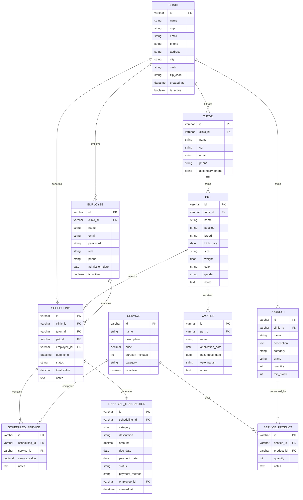
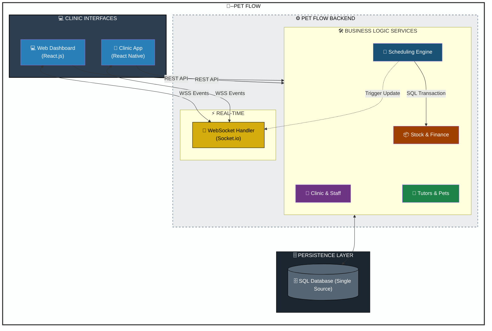

# Introdução

O mercado de produtos e serviços para animais de estimação tem apresentado crescimento constante no Brasil nas últimas décadas. Segundo dados da Associação Brasileira da Indústria de Produtos para Animais de Estimação (ABINPET), o país está entre os maiores mercados pet do mundo, impulsionado pelo aumento do número de animais de estimação e pela crescente humanização desses animais no ambiente familiar. Esse cenário tem ampliado a demanda por serviços especializados, como banho, tosa e atendimento personalizado.Apesar desse crescimento, muitos estabelecimentos do setor ainda utilizam métodos manuais ou sistemas pouco integrados para o controle de agendamentos, cadastro de clientes e gestão de serviços, o que pode gerar falhas operacionais e dificuldades administrativas. Nesse contexto, a aplicação de tecnologias da informação, especialmente por meio de sistemas distribuídos, apresenta-se como uma alternativa para modernizar e integrar os processos internos, contribuindo para maior organização e eficiência na gestão de pet shops.

## Problema
Pequenos e médios pet shops enfrentam dificuldades na organização de suas operações diárias, como controle de clientes, agendamentos de banho e tosa, registro de serviços e acompanhamento financeiro. Em muitos casos, essas informações são gerenciadas de forma manual ou por meio de ferramentas não integradas, como cadernos, planilhas e aplicativos de mensagens, o que pode gerar conflitos de horário, perda de dados e falhas na comunicação interna.

Esse cenário é comum em estabelecimentos com equipe reduzida, onde o gestor acumula funções administrativas e operacionais. A falta de organização impacta diretamente na eficiência, qualidade do atendimento e na capacidade de controle dentro do pet shop.

## Objetivos

Desenvolver um sistema de gestão integrado para um pet shop, com o objetivo de otimizar e centralizar as principais atividades operacionais e administrativas do estabelecimento. O sistema visa proporcionar maior organização, eficiência e controle dos processos internos, contemplando o gerenciamento de agendamentos, cadastro de clientes e seus respectivos pets, registro de serviços prestados e controle financeiro. Dessa forma, busca-se contribuir para a melhoria do atendimento, apoio à tomada de decisões e aumento da produtividade do negócio por meio da utilização de recursos tecnológicos adequados.

#### Objetivos Específicos

- Criar um módulo de agendamento para controle de horários de serviços como banho, tosa e demais atendimentos oferecidos pelo pet shop.
- Desenvolver um sistema de cadastro de clientes, contendo informações pessoais e de contato dos responsáveis pelos animais.
- Implementar um cadastro de pets, permitindo o registro de dados como nome, espécie, raça, idade e histórico de serviços realizados.
- Garantir a organização, integridade e segurança das informações armazenadas no sistema.

## Justificativa

O setor pet brasileiro figura entre os maiores do mundo e vem crescendo de forma expressiva nos últimos anos. Segundo dados da Associação Brasileira da Indústria de Produtos para Animais de Estimação (Abinpet), o Brasil encerrou 2024 com faturamento de R$ 75,4 bilhões no segmento, alta de 9,6% frente ao ano anterior, com projeção de alcançar R$ 77,2 bilhões em 2025 (ABINPET; IPB, 2024). Em termos de população animal, o país reúne aproximadamente 160,9 milhões de pets, ocupando a terceira posição no ranking mundial, atrás apenas dos Estados Unidos e da China (CRMV-PB, 2024).

Esse crescimento impulsiona a demanda por serviços especializados, como banho, tosa, veterinária e hotelaria, aumentando o volume de operações que os estabelecimentos precisam administrar no dia a dia. Ainda assim, grande parte dos pet shops segue operando de forma manual ou com ferramentas pouco integradas, recorrendo a cadernos, planilhas e aplicativos de mensagens para controlar agendamentos, cadastros e serviços. Esse modelo de gestão tende a gerar conflitos de horário, perda de histórico de atendimentos e sobrecarga sobre o gestor, que muitas vezes acumula tarefas administrativas e operacionais ao mesmo tempo (PETSHOPCONTROL, 2023).

Do lado do cliente, a ausência de um sistema centralizado também se faz sentir: confirmações que não chegam, dificuldade em saber o status do serviço e atendimentos que dependem exclusivamente da disponibilidade telefônica do estabelecimento. Em um setor cada vez mais disputado, esses detalhes têm peso direto na retenção de clientes.

O Pet Flow surge como resposta a esse cenário. Trata-se de uma aplicação distribuída que integra backend, interface web e mobile com o objetivo de centralizar as informações operacionais do pet shop em tempo real, permitindo que gestores e equipes acessem e atualizem dados de qualquer dispositivo. A escolha por uma arquitetura distribuída não é meramente técnica: ela reflete a realidade de um ambiente onde recepcionistas, tosadores e gestores precisam consultar e registrar informações simultaneamente, a partir de pontos distintos, o que torna inviável qualquer solução que não contemple essa natureza concorrente e distribuída das operações.

Mais do que uma ferramenta de digitalização, o Pet Flow se propõe a reduzir o retrabalho administrativo e devolver ao gestor e à equipe mais tempo e atenção para o atendimento em si.

**Referências:**
- ABINPET; IPB. *Release 3º Trimestre 2024*. Disponível em: https://www.gov.br/agricultura/pt-br/assuntos/camaras-setoriais-tematicas/documentos/camaras-setoriais/animais-e-estimacao/2024/41a-ro-05-11-2024/release_3trimestre_abinpet_ipb_2024.pdf. Acesso em: mar. 2026.
- CRMV-PB. *Brasil ocupa o 3º lugar no ranking mundial de países com mais animais domésticos*. Disponível em: https://www.crmvpb.org.br/29077-2/. Acesso em: mar. 2026.
- PETSHOPCONTROL. *7 dificuldades do empreendedor no mercado pet*. Disponível em: https://www.petshopcontrol.com.br/blog/dificuldades-empreendedor-mercado-pet/. Acesso em: mar. 2026.

## Público-Alvo

### 1. Definição Geral
O público-alvo do Pet Flow são pet shops que enfrentam dificuldade na organização de agendamento, controle de serviços (banho e tosa), gestão de clientes e acompanhamento da carga diária de trabalho. Gerando uma maior dificuldade no controle e gestão operacional, portando o Pet Flow busca centralizar as informações e oferecer um controle muito mais simplificado para os pet shops.

### 2. Segmentação

#### 2.1 Segmentação Firmográfica (B2B)
- Tipo de empresa: Pet Shop
- Porte: Qualquer porte de empresa (pequeno, médio e grande)
- Estrutura atual: Gestão manual ou uso de planilhas

#### 2.2 Segmentação Comportamental
- Usa WhatsApp ou telefone para agendamentos
- Possui agenda física ou planilha Excel
- Não possui dashboard operacional
- Tem dificuldade em visualizar:
  - Quantos atendimentos faltam no dia
  - Próximo atendimento
  - Serviços já concluídos
- Perde tempo com retrabalho administrativo

#### 2.3 Segmentação Psicográfica
- Empresário prático
- Focado em produtividade
- Busca organização e previsibilidade
- Sensível a custo, mas valoriza eficiência

### 3. Personas

### 3.1 Isabella Rocha

### 3.2 Carlos Mendes

# Especificações do Projeto

## Requisitos

As tabelas que se seguem apresentam os requisitos funcionais e não funcionais que detalham o escopo do projeto. Para determinar a prioridade de requisitos, aplicar uma técnica de priorização de requisitos e detalhar como a técnica foi aplicada.

### Requisitos Funcionais

|ID    | Descrição do Requisito  | Prioridade |
|------|-----------------------------------------|----|
|RF-001| Cadastro e login de usuários | ALTA | 
|RF-002| Cadastro, edição e exclusão de clientes  | ALTA |
|RF-003| Cadastro, edição e exclusão de pets  | ALTA |
|RF-004| Cadastro, edição e exclusão de serviços | ALTA |
|RF-005| Realizar, editar e cancelar agendamentos | ALTA |
|RF-006| Controle de entrada e saída de estoque   | MÉDIA |
|RF-007| Registro de receitas e despesas | MÉDIA |

### Requisitos não Funcionais

|ID     | Descrição do Requisito  |Prioridade |
|-------|-------------------------|----|
|RNF-001| O sistema deve ser dividido em módulos independentes (ex: Clientes, Agendamentos) para facilitar a manutenção | ALTA | 
|RNF-002|O sistema deve garantir a integridade dos dados, impedindo que um agendamento seja apagado sem deixar histórico |  ALTA | 
|RNF-003| A interface deve ser intuitiva, permitindo que o usuário realize um agendamento em menos de 4 cliques. |  MÉDIA | 
|RNF-004| O acesso às funcionalidades do sistema deve ser restrito através de login e senha para cada tipo de usuário |  ALTA | 
|RNF-005| As respostas das consultas (ex: busca de pets) devem ser exibidas em um tempo aceitável para o usuário |  BAIXA | 

## Restrições

O projeto está restrito pelos itens apresentados na tabela a seguir.

|ID| Restrição                                             |
|--|-------------------------------------------------------|
|01| O projeto deverá ser entregue até o final do semestre |
|02| Não pode ser desenvolvido um módulo de backend        |

Enumere as restrições à sua solução. Lembre-se de que as restrições geralmente limitam a solução candidata.

> **Links Úteis**:
> - [O que são Requisitos Funcionais e Requisitos Não Funcionais?](https://codificar.com.br/requisitos-funcionais-nao-funcionais/)
> - [O que são requisitos funcionais e requisitos não funcionais?](https://analisederequisitos.com.br/requisitos-funcionais-e-requisitos-nao-funcionais-o-que-sao/)

# Catálogo de Serviços

Descreva aqui todos os serviços que serão disponibilizados pelo seu projeto, detalhando suas características e funcionalidades.

# Arquitetura da Solução

## Entity-Relationship Diagram (ERD)

## Detalhe das tabelas

### 1. Table `CLINIC`

Armazena informações das clínicas/pet shops do sistema.

| Field | Type | Constraints | Description |
|-------|------|-------------|-------------|
| id | VARCHAR(36) | PK | Unique identifier (UUID) |
| name | VARCHAR(100) | NOT NULL | Clinic name |
| cnpj | VARCHAR(18) | UNIQUE | Formatted CNPJ |
| email | VARCHAR(100) | | Main email |
| phone | VARCHAR(15) | | Main phone |
| address | VARCHAR(200) | | Full address |
| city | VARCHAR(50) | | City |
| state | VARCHAR(2) | | State abbreviation |
| zip_code | VARCHAR(9) | | ZIP code |
| created_at | DATETIME | NOT NULL, DEFAULT CURRENT_TIMESTAMP | Registration date |
| is_active | BOOLEAN | NOT NULL, DEFAULT TRUE | Clinic status |

---

### 2. Table `TUTOR`

Armazena informações dos tutores (donos) dos pets.

| Field | Type | Constraints | Description |
|-------|------|-------------|-------------|
| id | VARCHAR(36) | PK | Unique identifier (UUID) |
| clinic_id | VARCHAR(36) | FK, NOT NULL | Reference to clinic |
| name | VARCHAR(100) | NOT NULL | Full name |
| cpf | VARCHAR(14) | UNIQUE | Formatted CPF |
| email | VARCHAR(100) | | Email |
| phone | VARCHAR(15) | NOT NULL | Main phone |
| secondary_phone | VARCHAR(15) | | Secondary phone |

---

### 3. Table `PET`

Armazena informações dos pets vinculados aos tutores.

| Field | Type | Constraints | Description |
|-------|------|-------------|-------------|
| id | VARCHAR(36) | PK | Unique identifier (UUID) |
| tutor_id | VARCHAR(36) | FK, NOT NULL | Reference to tutor |
| name | VARCHAR(50) | NOT NULL | Pet name |
| species | VARCHAR(30) | NOT NULL | Species (Dog, Cat, etc.) |
| breed | VARCHAR(50) | | Breed |
| birth_date | DATE | | Approximate birth date |
| size | VARCHAR(20) | | Size (Small, Medium, Large) |
| weight | DECIMAL(5,2) | | Weight in kg |
| color | VARCHAR(30) | | Coat color |
| gender | CHAR(1) | | M (Male) / F (Female) |
| notes | TEXT | | Medical/behavioral notes |

---

### 4. Table `VACCINE`

Armazena o histórico de vacinação dos pets.

| Field | Type | Constraints | Description |
|-------|------|-------------|-------------|
| id | VARCHAR(36) | PK | Unique identifier (UUID) |
| pet_id | VARCHAR(36) | FK, NOT NULL | Reference to pet |
| name | VARCHAR(100) | NOT NULL | Vaccine name |
| application_date | DATE | NOT NULL | Application date |
| next_dose_date | DATE | | Next dose date |
| veterinarian | VARCHAR(100) | | Veterinarian name |
| notes | TEXT | | Additional notes |

---

### 5. Table `EMPLOYEE`

Armazena os usuários do sistema (funcionários) vinculados à clínica.

| Field | Type | Constraints | Description |
|-------|------|-------------|-------------|
| id | VARCHAR(36) | PK | Unique identifier (UUID) |
| clinic_id | VARCHAR(36) | FK, NOT NULL | Reference to clinic |
| name | VARCHAR(100) | NOT NULL | Full name |
| email | VARCHAR(100) | UNIQUE, NOT NULL | Email (login) |
| password | VARCHAR(255) | NOT NULL | Encrypted password |
| role | VARCHAR(30) | NOT NULL | Role in the system |
| phone | VARCHAR(15) | | Contact phone |
| admission_date | DATE | | Admission date |
| is_active | BOOLEAN | NOT NULL, DEFAULT TRUE | Employee status |

---

### 6. Table `SERVICE`

Armazena os serviços oferecidos pelo pet shop.

| Field | Type | Constraints | Description |
|-------|------|-------------|-------------|
| id | VARCHAR(36) | PK | Unique identifier (UUID) |
| name | VARCHAR(100) | NOT NULL | Service name |
| description | TEXT | | Detailed description |
| price | DECIMAL(10,2) | NOT NULL | Price |
| duration_minutes | INT | | Estimated duration in minutes |
| category | VARCHAR(30) | NOT NULL | Service category |
| is_active | BOOLEAN | NOT NULL, DEFAULT TRUE | Service status |

---

### 7. Table `SERVICE_PRODUCT` (Junction Table)

Relaciona serviços com os produtos que utilizam (N:N).

| Field | Type | Constraints | Description |
|-------|------|-------------|-------------|
| id | VARCHAR(36) | PK | Unique identifier (UUID) |
| service_id | VARCHAR(36) | FK, NOT NULL | Reference to service |
| product_id | VARCHAR(36) | FK, NOT NULL | Reference to product |
| quantity | INT | NOT NULL | Quantity used in service |
| notes | TEXT | | Product usage notes |

---

### 8. Table `PRODUCT`

Controla o estoque de produtos da clínica.

| Field | Type | Constraints | Description |
|-------|------|-------------|-------------|
| id | VARCHAR(36) | PK | Unique identifier (UUID) |
| clinic_id | VARCHAR(36) | FK, NOT NULL | Reference to clinic |
| name | VARCHAR(100) | NOT NULL | Product name |
| description | TEXT | | Detailed description |
| category | VARCHAR(30) | NOT NULL | Product category |
| brand | VARCHAR(50) | | Brand |
| quantity | INT | NOT NULL, DEFAULT 0 | Quantity |
| min_stock | INT | NOT NULL, DEFAULT 0 | Minimum stock for alert |

---

### 9. Table `SCHEDULING`

Registra os agendamentos de serviços realizados pela clínica.

| Field | Type | Constraints | Description |
|-------|------|-------------|-------------|
| id | VARCHAR(36) | PK | Unique identifier (UUID) |
| clinic_id | VARCHAR(36) | FK, NOT NULL | Responsible clinic |
| tutor_id | VARCHAR(36) | FK, NOT NULL | Requesting tutor |
| pet_id | VARCHAR(36) | FK, NOT NULL | Pet to be attended |
| employee_id | VARCHAR(36) | FK, NOT NULL | Responsible professional |
| date_time | DATETIME | NOT NULL | Appointment date and time |
| status | VARCHAR(20) | NOT NULL | Appointment status |
| total_value | DECIMAL(10,2) | NOT NULL | Total appointment value |
| notes | TEXT | | General notes |

**Possible Status:**
- `Scheduled` - Appointment created
- `Confirmed` - Confirmed by tutor
- `In Progress` - Service being executed
- `Completed` - Service finished
- `Cancelled` - Appointment cancelled

---

### 10. Table `SCHEDULED_SERVICE` (Junction Table)

Relaciona agendamentos com serviços (N:N).

| Field | Type | Constraints | Description |
|-------|------|-------------|-------------|
| id | VARCHAR(36) | PK | Unique identifier (UUID) |
| scheduling_id | VARCHAR(36) | FK, NOT NULL | Reference to scheduling |
| service_id | VARCHAR(36) | FK, NOT NULL | Reference to service |
| service_value | DECIMAL(10,2) | NOT NULL | Service value at time of appointment |
| notes | TEXT | | Specific service notes |

---

### 11. Table `FINANCIAL_TRANSACTION`

Registra receitas e despesas do pet shop (uma por agendamento).

| Field | Type | Constraints | Description |
|-------|------|-------------|-------------|
| id | VARCHAR(36) | PK | Unique identifier (UUID) |
| scheduling_id | VARCHAR(36) | FK, UNIQUE, NOT NULL | Related scheduling (unique) |
| category | VARCHAR(50) | NOT NULL | Transaction category |
| description | VARCHAR(200) | NOT NULL | Detailed description |
| amount | DECIMAL(10,2) | NOT NULL | Transaction amount |
| due_date | DATE | | Due date |
| payment_date | DATE | | Payment date |
| status | VARCHAR(20) | NOT NULL | Payment status |
| payment_method | VARCHAR(20) | | Payment method |
| employee_id | VARCHAR(36) | FK, NOT NULL | Responsible employee |
| created_at | DATETIME | NOT NULL, DEFAULT CURRENT_TIMESTAMP | Creation date |

**Possible Status:**
- `Pending` - Awaiting payment
- `Paid` - Payment completed
- `Cancelled` - Transaction cancelled

---

### 12. System Design:

## Tecnologias Utilizadas

Descreva aqui qual(is) tecnologias você vai usar para resolver o seu problema, ou seja, implementar a sua solução. Liste todas as tecnologias envolvidas, linguagens a serem utilizadas, serviços web, frameworks, bibliotecas, IDEs de desenvolvimento, e ferramentas.

Apresente também uma figura explicando como as tecnologias estão relacionadas ou como uma interação do usuário com o Pet Flow vai ser conduzida, por onde ela passa até retornar uma resposta ao usuário.

## Hospedagem

Explique como a hospedagem e o lançamento da plataforma foi feita.

## Referência
Introdução 
- https://abinpet.org.br/dados-de-mercado
- https://www.abre.org.br/inovacao/mercado-pet-movimenta-r-754-bilhoes-em-2024-e-segue-em-expansao-no-brasil
- https://www.abre.org.br/inovacao/mercado-pet-movimenta-r-754-bilhoes-em-2024-e-segue-em-expansao-no-brasil
- https://zipdo.co/brazil-pet-industry-statistics/

