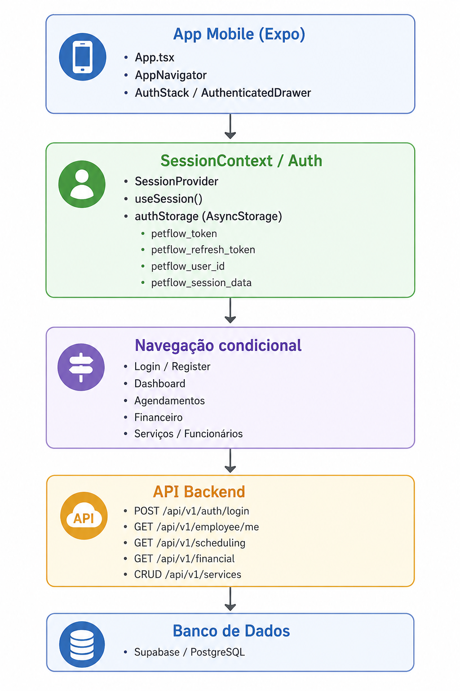

# Front-end Móvel

A versão móvel do sistema PetFlow foi desenvolvida para permitir que colaboradores acessem e gerenciem as páginas de  agendamentos, financeiro, funcionários, pets, tutores, serviços e produtos, diretamente pelo celular. A aplicação foca em usabilidade para o dia a dia da clínica, com navegação rápida e visibilidade prática.

## Projeto da Interface

A interface móvel utiliza um menu lateral (drawer navigation) para acesso às principais funcionalidades do aplicativo. O layout é baseado em cards e listas, facilitando a visualização das informações em telas menores. A tela de login conta com campos claros e botões destacados, enquanto a dashboard apresenta métricas e próximos agendamentos de forma objetiva. O design prioriza interações nativas, como rolagem por toque, feedback visual e elementos adaptados para dispositivos móveis.

O protótipo completo da interface está disponível no Figma:

🔗 **[Protótipo no Figma](https://www.figma.com/design/FEP3bCIGSpLnXUlkcwwtdd/workflow?node-id=0-1&t=OtzPpHNFHqzNRYBo-1)**

### Wireframes

As principais telas da aplicação incluem:

- *Login* — Tela de autenticação com validação de domínio corporativo (@petflow.com.br), campo de senha com visibilidade e opção "Lembrar de mim".
- *Dashboard* — Visão geral com cartões de métricas, número de pets cadastrados, receitas mensais, alertas de estoque e próximos agendamentos.
- *Agendamentos* — Lista de agendamentos com filtros por data, status e funcionário, cards de horário e ações de edição/exclusão.
- *Financeiro* — Cards de resumo de receita, despesas e saldo, lista de transações recentes, filtros de tipo e botão de inclusão de transações.
- *Funcionários* — Tela de funcionários disponível para usuários com perfil administrador ou dono.
- *Serviços / Produtos* — Listagem, pesquisa, criação, edição e exclusão via modal.
- *Pets / Tutores* — Cadastro e gerenciamento de pets e seus responsáveis, com informações básicas, pesquisa, edição e consulta dos registros.

### Design Visual

O estilo visual do aplicativo é leve e moderno, mantendo a identidade da página web com uso de azul primário. A paleta de cores e tipografia usada no tema móvel inclui:

- `#197BE9` — cor primária para botões e ícones principais
- `#1D2845` — cor primária escura para textos fortes e títulos
- `#4799EB` — variação clara para elementos de destaque
- `#DBEBF9` — fundo suave em áreas de destaque
- `#E4E7E9` — fundo principal da aplicação
- `#F6F8FA` — fundo de cards e seções
- `#FFFFFF` — branco para superfícies internas e modais
- `#7DC767` — cor de sucesso e receitas
- `#DE6767` — cor de alerta e despesas
- `Poppins, sans-serif` — Fonte principal

Os ícones são fornecidos por `@expo/vector-icons`, com destaque para ícones de materiais que representam pets, calendário, finanças e status. A interface usa transparência moderada e sombras suaves para organizar a hierarquia visual.

## Fluxo de Dados

## Tecnologias Utilizadas

| Tecnologia | Versão | Finalidade |
|---|---|---|
| Expo | ^54.0.35 | Desenvolvimento e execução do aplicativo mobile |
| React Native | 0.81.5 | Framework principal para interface nativa |
| TypeScript | ~5.9.2 | Tipagem e organização do código |
| @react-navigation/drawer | ^7.0.0 | Menu lateral de navegação |
| @react-navigation/native-stack | ^7.16.0 | Navegação entre telas |
| @react-native-async-storage/async-storage | 2.2.0 | Armazenamento local de dados da sessão |
| @expo/vector-icons | ^15.0.3 | Ícones de interface e botões |
| react-native-safe-area-context | ~5.6.0 | Ajuste do layout para IOS/Android |

## Considerações de Segurança

- Autenticação: login com validação do domínio corporativo `@petflow.com.br` e credenciais enviadas para o backend.
- Autorização: fluxo condicional no app exibe telas protegidas apenas quando há sessão ativa e role adequada.
- Armazenamento de token: uso de `AsyncStorage` para persistência de token, refresh token e dados de sessão, com limpeza em logout ou falha de autenticação.
- Comunicação segura: as requisições são feitas para a API usando `HTTPS` via `API_BASE_URL`.
- Validação de entrada: o frontend valida e-mail, senha, campos obrigatórios e números em formulários de serviços e financeiro.
- Renovação de sessão: o app suporta tentativa de renovação de token com `refresh_token` em caso de expiração.
- Minimização de risco: a interface não usa conteúdo HTML injetado; o React Native renderiza componentes nativos, reduzindo vetores de XSS.

## Implantação

1. Requisitos de hardware e software:
   - Node.js 18+ instalado
   - Expo CLI instalado (`npm install -g expo-cli` ou `npx expo`)
   - Navegador web ou dispositivo Android/iOS
   - Conexão com backend disponível em `https://pmv-si-2026-1-pe6-t1-t1-g5-pet-shop.onrender.com/api/v1`

2. Plataforma de hospedagem adequada:
   - Aplicação frontend executada por meio do Expo
   - Ambiente web ou dispositivos Android/iOS utilizando Expo Go
   - Backend: serviço já hospedado em Render

4. Configuração do ambiente de implantação:
   - Acessar o diretório do projeto
   - Instalar as dependências: `npm install`

5. Deploy da aplicação:
   - Para execução em navegador: `npx expo start`
   - Após a inicialização, a aplicação ficará disponível em um endereço local acessível pelo navegador
   - Para execução em dispositivo móvel: abra o aplicativo Expo Go e escaneie o QR Code exibido no terminal ou no navegador para acessar a aplicação

6. Testes de produção:
   - Realize login com um usuário válido
   - Verifique se a navegação entre telas funciona corretamente
   - Teste as funcionalidades principais do sistema, como consulta de dados, cadastros e edições
   - Garanta que a comunicação com a API esteja funcionando e que mensagens de erro apareçam quando necessário

## Testes

A validação dos principais fluxos do aplicativo PetFlow verifica se as funcionalidades implementadas apresentam o comportamento esperado em dispositivos móveis.

Os cenários de teste contemplam autenticação, navegação, gerenciamento de agendamentos, serviços, funcionários, financeiro e cadastro de pets e tutores, verificando o correto funcionamento da aplicação.

### Casos de teste principais

### 1. Dashboard

| ID     | Caso de teste             | Dados                                     | Resultado esperado                 | Resultado obtido                    | Referência                 |                                 
| ------ | ------------------------- | ----------------------------------------- | ---------------------------------- |------------------------------------ | ------------------------- |
| CT-001 | Acessar dashboard após login | Usuário autenticado | Dashboard carregada corretamente | Conforme esperado | [Demonstração](../docs/img/ct01e02-dash.gif) |
| CT-002 | Visualizar métricas | Pets, receitas e agendamentos cadastrados | Indicadores exibidos corretamente | Conforme esperado | [Demonstração](../docs/img/ct01e02-dash.gif) |
| CT-003 | Atualização de dados | Dados alterados no sistema | Dashboard reflete as alterações | Conforme esperado | [Demonstração](../docs/img/ct03-dash.gif) |

### 2. Serviços

| ID     | Caso de teste             | Dados                                     | Resultado esperado                 | Resultado obtido                    | Referência                 |                                 
| ------ | ------------------------- | ----------------------------------------- | ---------------------------------- |------------------------------------ | ------------------------- |
| CT-001 | Listar serviços | Usuário autenticado | Serviços carregados corretamente | Conforme esperado | [Demonstração](../docs/img/ct01-servico.gif) |
| CT-002 | Cadastrar serviço | Novo serviço | Serviço criado com sucesso | Conforme esperado | [Demonstração](../docs/img/ct02-servico.gif) |
| CT-003 | Editar serviço | Serviço existente | Dados atualizados corretamente | Conforme esperado | [Demonstração](../docs/img/ct03-servico.gif) |
| CT-004 | Excluir serviço | Serviço existente | Serviço removido da listagem | Conforme esperado | [Demonstração](../docs/img/ct04-servico.gif) |

### 3. Funcionários

| ID | Caso de teste | Dados | Resultado esperado | Resultado obtido | Referência |
|----|--------------|--------|-------------------|------------------|------------|
| CT-001 | Cadastrar funcionário | Dados válidos | Funcionário cadastrado com sucesso | Conforme esperado | [Demonstração](./img/CT01-funcionarios.mp4) |
| CT-002 | Buscar funcionário | Nome do funcionário | Funcionário localizado corretamente | Conforme esperado | [Demonstração](./img/CT02-funcionarios.mp4) |
| CT-003 | Editar funcionário | Funcionário existente | Dados atualizados corretamente | Conforme esperado | [Demonstração](./img/CT03-funcionarios.mp4) |
| CT-004 | Excluir funcionário | Funcionário existente | Funcionário removido da listagem | Conforme esperado | [Demonstração](./img/CT04-funcionarios.mp4) |

# Referências
- [React Native Documentation](https://reactnative.dev/docs/getting-started)
- [Expo Documentation](https://docs.expo.dev/)
- [React Navigation Documentation](https://reactnavigation.org/docs/getting-started/)
- [Material Icons via @expo/vector-icons](https://docs.expo.dev/guides/icons/)
