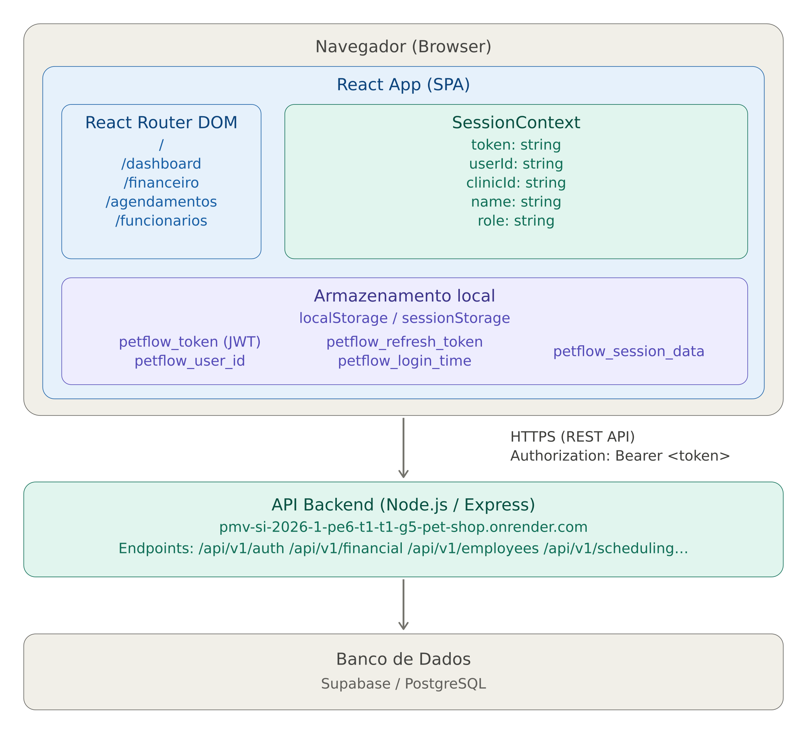

# Front-end Web

O PetFlow é uma aplicação web para gestão de pet shops, permitindo o gerenciamento de agendamentos, financeiro, funcionários, pets, tutores, serviços e produtos. A interface foi desenvolvida com foco em usabilidade, responsividade e uma experiência fluida para administradores e funcionários da clínica.

## Projeto da Interface Web

A interface web do PetFlow segue um layout de painel administrativo com sidebar fixa à esquerda para navegação e área de conteúdo principal à direita. O design prioriza clareza visual, cards informativos e tabelas para exibição de dados.

O protótipo completo da interface está disponível no Figma:

🔗 **[Protótipo no Figma](https://www.figma.com/design/FEP3bCIGSpLnXUlkcwwtdd/workflow?node-id=0-1&t=OtzPpHNFHqzNRYBo-1)**

### Wireframes

As principais telas da aplicação incluem:

- *Login* — Tela de autenticação com validação de domínio corporativo (@petflow.com.br)
- *Dashboard* — Visão geral com métricas e resumo da clínica
- *Agendamentos* — Listagem e gerenciamento de agendamentos de serviços
- *Financeiro* — Cards de resumo (receita, despesas, saldo), gráfico de barras dos últimos 6 meses e tabela de transações recentes
- *Funcionários* — Cadastro e gerenciamento de funcionários
- *Pets / Tutores* — Cadastro de pets e seus responsáveis
- *Serviços / Produtos* — Catálogo de serviços e produtos oferecidos

### Design Visual

O projeto utiliza CSS Custom Properties definidas em src/styles/variables.css:

| Variável | Valor | Descrição |
|---|---|---|
| --color-primary | #197BE9 | Cor primária (botões, links, destaques) |
| --color-primary-dark | #1D2845 | Cor primária escura (hover, textos fortes) |
| --color-primary-light | #4799EB | Cor primária clara (fundo do login) |
| --color-primary-bg | #DBEBF9 | Fundo com tom primário suave |
| --color-bg-main | #E4E7E9 | Fundo principal da aplicação |
| --color-bg-sidebar | #F6F8FA | Fundo da sidebar e hover de linhas |
| --color-bg-card | #F6F8FA | Fundo dos cards |
| --color-bg-white | #FFFFFF | Fundo branco (modais, painéis) |
| --color-bg-table-header | rgba(240,240,240,0.71) | Fundo do cabeçalho de tabelas |
| --color-bg-button-icon | #F5F5F5 | Fundo de botões de ícone |
| --color-text-primary | #141313 | Texto principal |
| --color-text-secondary | #151515 | Texto secundário |
| --color-text-placeholder | rgba(20,19,19,0.57) | Texto de placeholder |
| --color-text-white | #FFFFFF | Texto branco |
| --color-text-muted | rgba(21,21,21,0.75) | Texto suavizado |
| --color-success | #7DC767 | Cor de sucesso (receitas, positivo) |
| --color-danger | #DE6767 | Cor de perigo (despesas, erros) |
| --color-danger-bg | #F5E0E0 | Fundo de alerta de perigo |
| --color-border | #D9D9D9 | Cor de bordas |
| --color-border-active | #4799EB | Borda de input ativo/focado |
| --shadow-card | 0px 2px 4px rgba(0,0,0,0.25) | Sombra de cards |
| --shadow-sidebar-item | 0px 2px 2px rgba(0,0,0,0.25) | Sombra de item da sidebar |
| --shadow-input | 0px 4px 4px rgba(0,0,0,0.25) | Sombra de inputs |
| --font-family | 'Poppins', sans-serif | Fonte principal |
| --font-size-xs | 12px | Tamanho extra pequeno |
| --font-size-sm | 13px | Tamanho pequeno |
| --font-size-base | 14px | Tamanho base |
| --font-size-md | 15px | Tamanho médio |
| --font-size-lg | 17px | Tamanho grande |
| --font-size-xl | 20px | Tamanho extra grande |
| --font-size-2xl | 22px | Tamanho 2x grande |
| --font-size-3xl | 32px | Tamanho 3x grande |
| --font-weight-regular | 400 | Peso regular |
| --font-weight-medium | 500 | Peso médio |
| --font-weight-semibold | 600 | Peso semi-negrito |
| --font-weight-bold | 700 | Peso negrito |
| --spacing-xs | 4px | Espaçamento extra pequeno |
| --spacing-sm | 8px | Espaçamento pequeno |
| --spacing-md | 12px | Espaçamento médio |
| --spacing-lg | 16px | Espaçamento grande |
| --spacing-xl | 20px | Espaçamento extra grande |
| --spacing-2xl | 24px | Espaçamento 2x grande |
| --spacing-3xl | 32px | Espaçamento 3x grande |
| --radius-sm | 5px | Borda arredondada pequena |
| --radius-md | 6px | Borda arredondada média |
| --radius-lg | 10px | Borda arredondada grande |
| --radius-xl | 11px | Borda arredondada extra grande |
| --radius-round | 50% | Totalmente circular |
| --sidebar-width | 180px | Largura da sidebar |
| --transition-fast | 0.15s ease | Transição rápida |
| --transition-normal | 0.25s ease | Transição normal |

## Fluxo de Dados

### Fluxo de Autenticação

1. O usuário informa e-mail (@petflow.com.br) e senha na tela de login
2. O frontend envia POST /api/v1/auth/login com as credenciais
3. O backend retorna token (JWT), refresh_token e user_id
4. O frontend armazena esses dados em localStorage (se "Lembrar de mim") ou sessionStorage
5. O SessionContext é inicializado e busca os dados do funcionário via GET /api/v1/employees/:userId
6. Os dados da sessão (userId, clinicId, name, role) são cacheados no storage e disponibilizados via Context API para todos os componentes
7. Todas as requisições subsequentes incluem o header Authorization: Bearer <token>
8. A sessão expira após 1 hora; se houver refresh_token, o sistema tenta renovar automaticamente

## Tecnologias Utilizadas

| Tecnologia | Versão | Finalidade |
|---|---|---|
| React | 19.2.5 | Biblioteca de UI (componentes) |
| TypeScript | 6.0.2 | Tipagem estática |
| Vite | 8.0.10 | Build tool e dev server |
| React Router DOM | 6.28.0 | Roteamento SPA |
| React Icons | 5.3.0 | Ícones (Material Design) |
| CSS Modules | — | Estilização com escopo local |
| ESLint | 10.2.1 | Linting e qualidade de código |

## Considerações de Segurança

- *Autenticação:* Login via JWT (JSON Web Token) com validação de domínio corporativo (@petflow.com.br) no frontend
- *Autorização:* Rotas protegidas com componente RequireAuth que verifica a existência de token válido antes de renderizar páginas autenticadas
- *Armazenamento de token:* Uso de localStorage (com opção "Lembrar de mim") ou sessionStorage para persistência do token
- *Comunicação segura:* Todas as requisições à API utilizam HTTPS
- *Validação de entrada:* Inputs validados no frontend (formato de e-mail, campos obrigatórios) e no backend
- *Proteção contra XSS:* React escapa automaticamente conteúdo renderizado; não há uso de dangerouslySetInnerHTML
- *CORS:* Backend configurado para aceitar requisições apenas de origens autorizadas

## Implantação

A aplicação frontend é implantada como um site estático (SPA):

1. *Requisitos:*
   - Node.js 18+ e npm/yarn

2. *Plataforma de hospedagem:*
   - Frontend: Vercel
   - Backend: Render (https://pmv-si-2026-1-pe6-t1-t1-g5-pet-shop.onrender.com)

3. *Configuração do ambiente:*
   - A URL da API já está configurada como fallback no código (https://pmv-si-2026-1-pe6-t1-t1-g5-pet-shop.onrender.com/api/v1), dispensando variáveis de ambiente em produção

   - Configurar redirects para SPA (todas as rotas apontam para index.html)

4. *Deploy:*
   bash
   npm install
   npm run build
   
   O diretório dist/ gerado contém os arquivos estáticos prontos para servir.

5. *Verificação:*
   - Testar login com credenciais válidas
   - Verificar se todas as rotas carregam corretamente
   - Confirmar comunicação com a API (CORS, token)
   - Testar responsividade em diferentes dispositivos
     
## Testes

[Descreva a estratégia de teste, incluindo os tipos de teste a serem realizados (unitários, integração, carga, etc.) e as ferramentas a serem utilizadas.]

1. Crie casos de teste para cobrir todos os requisitos funcionais e não funcionais da aplicação.
2. Implemente testes unitários para testar unidades individuais de código, como funções e classes.
3. Realize testes de integração para verificar a interação correta entre os componentes da aplicação.
4. Execute testes de carga para avaliar o desempenho da aplicação sob carga significativa.
5. Utilize ferramentas de teste adequadas, como frameworks de teste e ferramentas de automação de teste, para agilizar o processo de teste.

# Referências

- [React Documentation](https://react.dev/)
- [Vite Documentation](https://vite.dev/)
- [React Router Documentation](https://reactrouter.com/)
- [TypeScript Documentation](https://www.typescriptlang.org/)
- [Figma - Protótipo PetFlow](https://www.figma.com/design/FEP3bCIGSpLnXUlkcwwtdd/workflow?node-id=0-1&t=OtzPpHNFHqzNRYBo-1)
