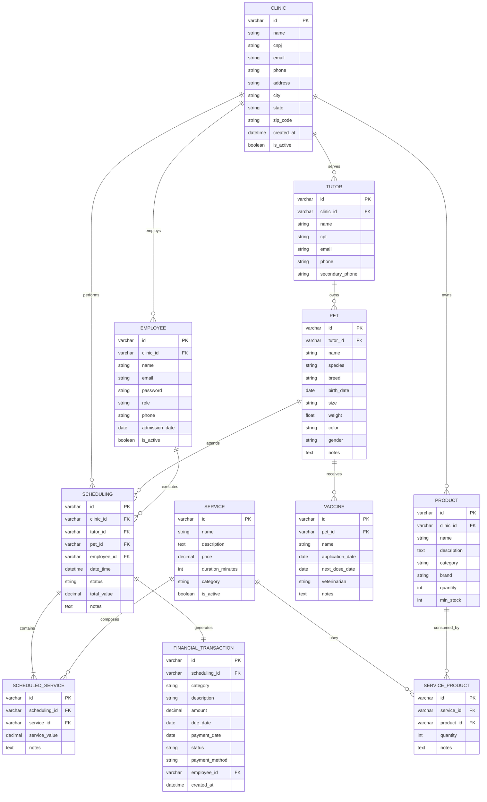
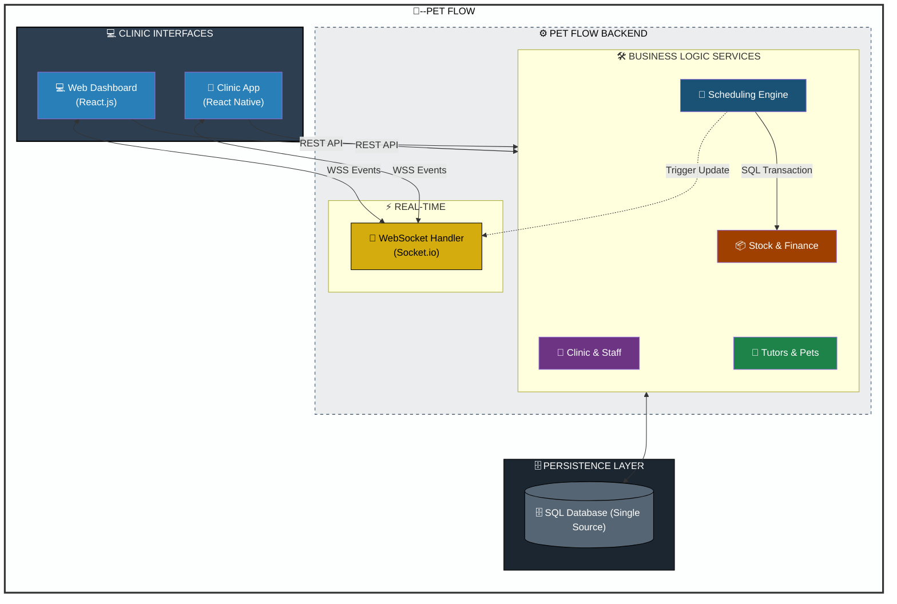

## Entity-Relationship Diagram (ERD)

## Table Details

### 1. Table `CLINIC`

Armazena informações das clínicas/pet shops do sistema.

| Field | Type | Constraints | Description |
|-------|------|-------------|-------------|
| id | VARCHAR(36) | PK | Unique identifier (UUID) |
| name | VARCHAR(100) | NOT NULL | Clinic name |
| cnpj | VARCHAR(18) | UNIQUE | Formatted CNPJ |
| email | VARCHAR(100) | | Main email |
| phone | VARCHAR(15) | | Main phone |
| address | VARCHAR(200) | | Full address |
| city | VARCHAR(50) | | City |
| state | VARCHAR(2) | | State abbreviation |
| zip_code | VARCHAR(9) | | ZIP code |
| created_at | DATETIME | NOT NULL, DEFAULT CURRENT_TIMESTAMP | Registration date |
| is_active | BOOLEAN | NOT NULL, DEFAULT TRUE | Clinic status |

---

### 2. Table `TUTOR`

Armazena informações dos tutores (donos) dos pets.

| Field | Type | Constraints | Description |
|-------|------|-------------|-------------|
| id | VARCHAR(36) | PK | Unique identifier (UUID) |
| clinic_id | VARCHAR(36) | FK, NOT NULL | Reference to clinic |
| name | VARCHAR(100) | NOT NULL | Full name |
| cpf | VARCHAR(14) | UNIQUE | Formatted CPF |
| email | VARCHAR(100) | | Email |
| phone | VARCHAR(15) | NOT NULL | Main phone |
| secondary_phone | VARCHAR(15) | | Secondary phone |

---

### 3. Table `PET`

Armazena informações dos pets vinculados aos tutores.

| Field | Type | Constraints | Description |
|-------|------|-------------|-------------|
| id | VARCHAR(36) | PK | Unique identifier (UUID) |
| tutor_id | VARCHAR(36) | FK, NOT NULL | Reference to tutor |
| name | VARCHAR(50) | NOT NULL | Pet name |
| species | VARCHAR(30) | NOT NULL | Species (Dog, Cat, etc.) |
| breed | VARCHAR(50) | | Breed |
| birth_date | DATE | | Approximate birth date |
| size | VARCHAR(20) | | Size (Small, Medium, Large) |
| weight | DECIMAL(5,2) | | Weight in kg |
| color | VARCHAR(30) | | Coat color |
| gender | CHAR(1) | | M (Male) / F (Female) |
| notes | TEXT | | Medical/behavioral notes |

---

### 4. Table `VACCINE`

Armazena o histórico de vacinação dos pets.

| Field | Type | Constraints | Description |
|-------|------|-------------|-------------|
| id | VARCHAR(36) | PK | Unique identifier (UUID) |
| pet_id | VARCHAR(36) | FK, NOT NULL | Reference to pet |
| name | VARCHAR(100) | NOT NULL | Vaccine name |
| application_date | DATE | NOT NULL | Application date |
| next_dose_date | DATE | | Next dose date |
| veterinarian | VARCHAR(100) | | Veterinarian name |
| notes | TEXT | | Additional notes |

---

### 5. Table `EMPLOYEE`

Armazena os usuários do sistema (funcionários) vinculados à clínica.

| Field | Type | Constraints | Description |
|-------|------|-------------|-------------|
| id | VARCHAR(36) | PK | Unique identifier (UUID) |
| clinic_id | VARCHAR(36) | FK, NOT NULL | Reference to clinic |
| name | VARCHAR(100) | NOT NULL | Full name |
| email | VARCHAR(100) | UNIQUE, NOT NULL | Email (login) |
| password | VARCHAR(255) | NOT NULL | Encrypted password |
| role | VARCHAR(30) | NOT NULL | Role in the system |
| phone | VARCHAR(15) | | Contact phone |
| admission_date | DATE | | Admission date |
| is_active | BOOLEAN | NOT NULL, DEFAULT TRUE | Employee status |

---

### 6. Table `SERVICE`

Armazena os serviços oferecidos pelo pet shop.

| Field | Type | Constraints | Description |
|-------|------|-------------|-------------|
| id | VARCHAR(36) | PK | Unique identifier (UUID) |
| name | VARCHAR(100) | NOT NULL | Service name |
| description | TEXT | | Detailed description |
| price | DECIMAL(10,2) | NOT NULL | Price |
| duration_minutes | INT | | Estimated duration in minutes |
| category | VARCHAR(30) | NOT NULL | Service category |
| is_active | BOOLEAN | NOT NULL, DEFAULT TRUE | Service status |

---

### 7. Table `SERVICE_PRODUCT` (Junction Table)

Relaciona serviços com os produtos que utilizam (N:N).

| Field | Type | Constraints | Description |
|-------|------|-------------|-------------|
| id | VARCHAR(36) | PK | Unique identifier (UUID) |
| service_id | VARCHAR(36) | FK, NOT NULL | Reference to service |
| product_id | VARCHAR(36) | FK, NOT NULL | Reference to product |
| quantity | INT | NOT NULL | Quantity used in service |
| notes | TEXT | | Product usage notes |

---

### 8. Table `PRODUCT`

Controla o estoque de produtos da clínica.

| Field | Type | Constraints | Description |
|-------|------|-------------|-------------|
| id | VARCHAR(36) | PK | Unique identifier (UUID) |
| clinic_id | VARCHAR(36) | FK, NOT NULL | Reference to clinic |
| name | VARCHAR(100) | NOT NULL | Product name |
| description | TEXT | | Detailed description |
| category | VARCHAR(30) | NOT NULL | Product category |
| brand | VARCHAR(50) | | Brand |
| quantity | INT | NOT NULL, DEFAULT 0 | Quantity |
| min_stock | INT | NOT NULL, DEFAULT 0 | Minimum stock for alert |

---

### 9. Table `SCHEDULING`

Registra os agendamentos de serviços realizados pela clínica.

| Field | Type | Constraints | Description |
|-------|------|-------------|-------------|
| id | VARCHAR(36) | PK | Unique identifier (UUID) |
| clinic_id | VARCHAR(36) | FK, NOT NULL | Responsible clinic |
| tutor_id | VARCHAR(36) | FK, NOT NULL | Requesting tutor |
| pet_id | VARCHAR(36) | FK, NOT NULL | Pet to be attended |
| employee_id | VARCHAR(36) | FK, NOT NULL | Responsible professional |
| date_time | DATETIME | NOT NULL | Appointment date and time |
| status | VARCHAR(20) | NOT NULL | Appointment status |
| total_value | DECIMAL(10,2) | NOT NULL | Total appointment value |
| notes | TEXT | | General notes |

**Possible Status:**
- `Scheduled` - Appointment created
- `Confirmed` - Confirmed by tutor
- `In Progress` - Service being executed
- `Completed` - Service finished
- `Cancelled` - Appointment cancelled

---

### 10. Table `SCHEDULED_SERVICE` (Junction Table)

Relaciona agendamentos com serviços (N:N).

| Field | Type | Constraints | Description |
|-------|------|-------------|-------------|
| id | VARCHAR(36) | PK | Unique identifier (UUID) |
| scheduling_id | VARCHAR(36) | FK, NOT NULL | Reference to scheduling |
| service_id | VARCHAR(36) | FK, NOT NULL | Reference to service |
| service_value | DECIMAL(10,2) | NOT NULL | Service value at time of appointment |
| notes | TEXT | | Specific service notes |

---

### 11. Table `FINANCIAL_TRANSACTION`

Registra receitas e despesas do pet shop (uma por agendamento).

| Field | Type | Constraints | Description |
|-------|------|-------------|-------------|
| id | VARCHAR(36) | PK | Unique identifier (UUID) |
| scheduling_id | VARCHAR(36) | FK, UNIQUE, NOT NULL | Related scheduling (unique) |
| category | VARCHAR(50) | NOT NULL | Transaction category |
| description | VARCHAR(200) | NOT NULL | Detailed description |
| amount | DECIMAL(10,2) | NOT NULL | Transaction amount |
| due_date | DATE | | Due date |
| payment_date | DATE | | Payment date |
| status | VARCHAR(20) | NOT NULL | Payment status |
| payment_method | VARCHAR(20) | | Payment method |
| employee_id | VARCHAR(36) | FK, NOT NULL | Responsible employee |
| created_at | DATETIME | NOT NULL, DEFAULT CURRENT_TIMESTAMP | Creation date |

**Possible Status:**
- `Pending` - Awaiting payment
- `Paid` - Payment completed
- `Cancelled` - Transaction cancelled

---

### 12. System Design:
